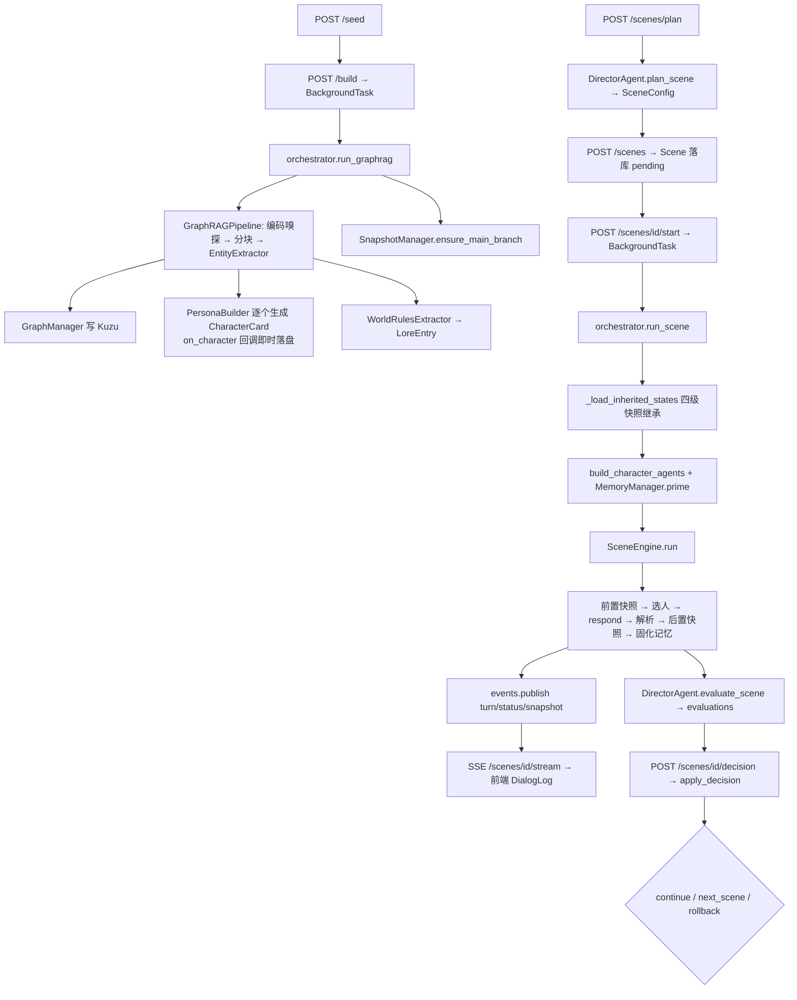

# CLAUDE.md — PlotSystem 根文档

> **本文件是 AI 编程助手进入本仓库的第一入口。**
> 它不是设计愿景书，而是一份**与代码对齐的地图 + 契约清单**。
> 当文档与代码冲突时，**以代码为准**，并顺手把本文档改对。

---

## 0. 阅读与使用约定

### 0.1 三类标记

全文所有描述必须落在以下三类之一，写新内容时也请沿用：

| 标记 | 含义 | 你该怎么做 |
|------|------|-----------|
| **【实况】** | 代码里真实存在且在运行路径上 | 可直接依赖，修改前先读对应文件 |
| **【契约】** | 不可破坏的架构红线 | 改动必须保持，破坏前先和人类确认 |
| **【设想】** | 尚未实现的规划 | **不要假装它存在**；要做时先补接口再实现 |

未标记的段落默认是【实况】。

### 0.2 文档体系

| 文件 | 面向 | 内容 |
|------|------|------|
| `CLAUDE.md`（本文件） | AI 助手 + 开发者 | 代码地图、数据契约、红线约束、已知缺陷、设想清单 |
| `README.md` | 人类 | 项目介绍、截图、快速启动 |
| `docs/fix-tickets/` | AI 助手 | 在途工单，每单自包含、可并行；索引 `README.md`、流程规则 `CONVENTIONS.md`、排期理由与 PR 结论 `NOTES.md` |
| `.env.example` | 全体 | **配置项的唯一真值**，本文档不复制其内容 |
| `backend/models.py` | 全体 | **数据模型的唯一定义源**，本文档只讲语义与陷阱 |

### 0.3 给 AI 助手的硬性要求

1. 改代码前先看第 7 节【契约】，那 9 条是本系统的承重墙。
2. 改数据模型必须走第 5.4 节的三步 checklist，否则字段会静默丢失。
3. 第 12 节列出的"已知缺陷与 dead code"里的东西**不要顺手修**——除非工单要求，否则先问。
4. 不要为了"补齐文档"新建 md 文件；改动落到本文件对应章节即可。
5. 不新增核心依赖；确需新增，先在第 2 节登记。

---

## 1. 项目是什么

### 1.1 定位

PlotSystem 是一个**多分支、多智能体剧情推演系统**（科创项目）。

用户上传非结构化种子文本（小说 / 剧本 / 世界观设定），系统抽取实体建立知识图谱，
生成一批带**信息不对称**的角色智能体；随后由**导演智能体**按场次组织推演，
每场结束后评估并决策（继续 / 下一场 / 回滚）；全程以场次为单位自动打快照，
用户可从任意快照分叉出 IF 线；最后由总结智能体产出小说 / 剧本 / 报告。

### 1.2 血统与取舍（理解设计动机用）

| 来源 | 学到了什么 | 抛弃了什么 |
|------|-----------|-----------|
| **MiroFish**（原基座，多智能体群体模拟） | 多层记忆设计、实体抽取 → 图谱 → 智能体的整体流水线 | 强依赖 Zep（付费昂贵）；一切实体被拍平成"社交账号"（游戏剧情里的天灾也变成发帖账号）；快照/分支难做 |
| **SillyTavern**（角色扮演） | 角色卡（persona / speech_style）、lorebook 按关键词动态注入、持续上下文工程 | — |
| **"GPT 接入原神"类项目** | 长线任务与具体角色都由 AI 驱动，而非脚本 | — |

**因此本项目的形态是**：用户给大方向 → 导演做宏观调控 → 角色自然演绎。
不是剧本执行器，也不是社交模拟器。

> 【实况】CLAUDE.md 早期版本把 AutoGen / LlamaIndex / microsoft-graphrag 写成核心实现，
> 实际开发中三者均未接入运行路径（详见第 2 节）。这是开发期的技术选型演进结果，
> 不影响最终能力，**不要试图"修复"回去**。

### 1.3 真实工作流

```
① 上传种子文本  POST /projects/{id}/seed
② 触发构建      POST /projects/{id}/build   （后台任务）
        ↓  自研 LLM 抽取（非 microsoft/graphrag）
   实体 + 关系 → Kuzu 图谱
   角色实体     → CharacterCard（含 known_facts / unknown_facts）
   世界规则     → LoreEntry
   并创建 main 分支
③ 导演规划场景  POST /projects/{id}/scenes/plan  → SceneConfig（建议，不落库）
④ 创建场景      POST /projects/{id}/scenes       → Scene（落库，pending）
⑤ 开始模拟      POST /scenes/{id}/start          （后台任务 + SSE）
        ↓  前置快照 → 轮询发言 → 解析三态 → 终止判定 → 后置快照 → 记忆固化
⑥ 自动评估      DirectorAgent.evaluate_scene → evaluations 表 → SSE 推送
⑦ 导演决策      POST /scenes/{id}/decision
        ├─ continue   同场加轮次重跑
        ├─ next_scene 规划并创建新场景（可人工覆盖角色/地点/条件）
        └─ rollback   恢复快照 + 新建"回滚重演"场景
⑧ 生成输出      POST /projects/{id}/output  → 网文 / 剧本 / 舞台剧 / 报告 / 原始日志
```

### 1.4 设计信条

- **信息不对称是第一性的**：角色只能看到自己的 `known_facts`。公主不在朝堂，
  就该在与王子对话后才自然地表现出惊讶。这是本项目区别于普通群聊模拟的核心。
  与之互补的是 **`WorldState`（分支级世界变量）**：信息不对称管"不该知道的不知道"，
  世界状态管"该传播的能传播"——季节、势力态度这类**所有人都能感知**的世界层事实，
  跨场次持续演进并注入每个在场角色。两者的边界就是"这件事是不是公开的"。
- **快照不追求确定性重放**：LLM 有随机性，回到快照重跑不会 100% 复现。
  快照的目的是 **"我能回到这里分叉 IF 线"** 和 **"演得不好能回来调"** ，不是版本控制。
- **导演宏观、角色微观**：导演不写台词，只搭场景、选人、评估、决策。
- **本地优先 / 优雅降级**：kuzu、chromadb、autogen 全部缺失时系统仍可跑（见【契约6】）。
- **编排集中**：所有跨模块调用只允许发生在 `backend/services/orchestrator.py`。

---

## 2. 技术栈实况

| 层次 | 实际使用 | 状态 | 说明 / 真实实现位置 |
|------|---------|------|--------------------|
| LLM 接入 | OpenAI 兼容 SDK + tenacity | ✅ 已接入 | `backend/utils/llm.py` 是**唯一出口** |
| 实体抽取 | 自研 LLM + JSON 提示词 | ✅ 已接入 | `graphrag_pipeline/entity_extractor.py` |
| 知识图谱 | Kuzu（嵌入式，Cypher） | ✅ 已接入 | `knowledge_graph/graph_manager.py`；缺失时降级为空图 |
| 向量记忆 | chromadb 原生 client + 远程 embedding | ✅ 已接入 | `memory/long_term.py` + `memory/embeddings.py` |
| 场景引擎 | **自研**手写对话循环 | ✅ 已接入 | `scene_engine/engine.py` |
| 后端 | FastAPI + Uvicorn + sse-starlette | ✅ 已接入 | `backend/main.py` |
| 持久化 | aiosqlite + JSON 文件树 | ✅ 已接入 | `utils/db.py` + `services/repository.py` |
| 前端 | Vue 3 + Vite + Pinia + Axios | ✅ 已接入 | `frontend/src/` |
| 图谱可视化 | AntV G6 | ✅ 已接入 | `GraphViewer.vue` / `GraphViewer2.vue` |
| **AutoGen** (`autogen-agentchat`) | 仅 `base_agent.py` 与 `CharacterAgent.get_autogen_agent()` | 🚫 **已评估，倾向不引入** | 无调用方。GroupChat 编排会打破【契约3】的 system 静态 / user 动态结构；未来的"角色动作交由环境智能体裁决"用 OpenAI 原生 function calling 即可，不需要 AutoGen |
| **LlamaIndex** | 无 | 🚫 **已评估，暂不引入** | 全仓库零 import。它对长期记忆的真实增量价值 = 时间衰减权重 + 混合检索(BM25) + 分层索引，这三项可在现有 Chroma 封装上手写，不必引入整个框架 |
| **microsoft/graphrag** | 无 | ❌ **未使用** | 已移入 `[project.optional-dependencies].graphrag` |

> 改 RAG 检索请改 `memory/long_term.py`；改实体抽取请改 `entity_extractor.py` 的提示词；
> 改发言顺序请改 `scene_engine/engine.py` 与 `scene_engine/speaker_selector.py`。
> **不要去找 GroupChat 或 settings.yaml。**

### 2.1 四路异构模型

`settings.director_model / character_model / summary_model / selector_model` 分别读
`LLM_MODEL_DIRECTOR / CHARACTER / SUMMARY / SELECTOR`，留空回退 `LLM_MODEL_NAME`。四者均已生效。

温度约定：角色 0.8（创意）、导演 0.3（一致）、总结 0.7（平衡）、选择器 0.2（判断）。

selector 另有独立的 `LLM_SELECTOR_BASE_URL / LLM_SELECTOR_API_KEY`（留空复用主配置），
用于把"发言者打分"这种短输入短输出的判断任务挂到本地小模型上。透传路径仍是
`utils/llm.py` 的 `chat()/chat_safe()` 的 `base_url` / `api_key` 参数，**契约7 未破**。

---

## 3. 代码地图

```
backend/
├── models.py           ★ 所有领域 dataclass 的唯一定义处
├── config.py           ★ pydantic-settings 单例 + 派生路径 + 三路模型属性
├── exceptions.py       业务异常树（ConflictError→409，其余 PlotSystemError→404）
├── main.py             FastAPI 装配 + 全局异常处理 + lifespan（init_db / 构建对账）
│
├── services/           ★★ 编排层：找业务逻辑先看这里
│   ├── orchestrator.py   唯一跨模块编排点（构建/规划/运行/决策/输出/对账）
│   ├── repository.py     唯一持久化出口（SQLite + 角色卡 JSON + 分支世界变量 JSON）
│   ├── world_state.py    世界变量的规范化/预算/渲染（纯函数，无 IO；读写两侧共用）
│   ├── inspection.py     ★ 角色内部状态的唯一只读查询层（面板/导演/总结共用）
│   └── events.py         SSE 内存事件总线（asyncio.Queue）
│
├── api/                路由层：只做参数校验 → 调 services → to_dict
│   projects / characters / scenes / director / branches / output / graph / schemas
│
├── agents/
│   ├── character_agent.py  角色演绎（prompt 构建 + 记忆检索 + chat_safe）
│   ├── director_agent.py   plan_scene / evaluate_scene / make_decision
│   ├── summary_agent.py    5 种格式输出
│   └── base_agent.py       AutoGen 模型客户端封装（⚠️ 无调用方）
│
├── scene_engine/
│   ├── engine.py           手写对话循环 + 三态解析 + 快照编排
│   ├── speaker_selector.py selector 模式的独立评分选人（工单11）
│   ├── termination.py      终止条件判定
│   └── scene_config.py     仅从 models.py 再导出
│
├── memory/
│   ├── memory_manager.py 三层门面
│   ├── short_term.py     deque 对话缓冲（纯内存）
│   ├── long_term.py      ChromaDB 向量库（可降级为字符重叠伪检索）
│   ├── episodic.py       关键词启发式的事件摘要（纯内存）
│   └── embeddings.py     RemoteEmbeddingFunction（替换 Chroma 默认本地 onnx 模型）
│
├── knowledge_graph/
│   ├── graph_manager.py  Kuzu 操作（同步 API 的 async 包装）
│   ├── schema.py         DDL
│   └── queries.py        ⚠️ dead code，零 import
│
├── snapshot/
│   ├── snapshot_manager.py 快照创建/恢复/删除 + 分支 fork + 分支记忆复制 + 分支树
│   ├── branch_tree.py      树结构组装
│   └── models.py           仅从 models.py 再导出
│
├── graphrag_pipeline/
│   ├── pipeline.py        分块 → 抽取 → 写图 → 生成角色卡 → 提取世界规则
│   ├── entity_extractor.py
│   ├── persona_builder.py
│   └── world_rules.py
│
└── utils/
    ├── llm.py         ★ LLM 唯一出口（chat / chat_safe / estimate_tokens）
    ├── context.py     ★ 统一上下文压缩管线（fit_lines / compact_lines，4 种策略）
    ├── db.py          SQLite DDL + 连接
    ├── serializer.py  to_dict（dataclass → JSON 安全字典）
    ├── logger.py
    └── init_db.py     `python -m backend.utils.init_db`

frontend/src/
├── pages/       Workspace.vue（项目+图谱） / Director.vue（分支树+日志+决策） / Output.vue
├── components/  GraphViewer.vue、GraphViewer2.vue、SceneTree.vue、
│                CharacterCard.vue、DialogLog.vue、DirectorPanel.vue
├── stores/      project.ts / characters.ts / scenes.ts / director.ts
├── router/index.ts、api/client.ts、types/index.ts、styles/global.css
```

**入口速查**：
- 想改「一场戏怎么演」→ `scene_engine/engine.py`
- 想改「角色说什么」→ `agents/character_agent.py`
- 想改「谁来演、演完怎么办」→ `services/orchestrator.py`
- 想改「存了什么」→ `services/repository.py` + `utils/db.py`
- 想加 API → `api/*.py`（**业务逻辑不要写在这层**）

---

## 4. 数据模型

> **唯一定义源：`backend/models.py`。** 这里只讲语义与陷阱，不复制字段清单。

### 4.1 模型总览

| 模型 | 作用 | 存放位置 |
|------|------|---------|
| `Project` | 推演项目（含**主线目标锚点** `narrative_goal` / `ending_criteria`） | SQLite `projects` |
| `CharacterCard` | 角色卡（persona + 信息不对称 + 关系 + 当前状态） | **文件** `characters/{cid}.json` |
| `CharacterState` | 角色在某时刻的快照态（含短期缓冲 / 事件摘要） | 快照目录 JSON |
| `CharacterInspection` | Inspection 层的只读组装结果（**不落库**） | 运行时 |
| `LoreEntry` | 世界观条目（keywords 触发、scope 控制可见范围、priority 排序） | 内嵌于角色卡 |
| `WorldState` | **分支级**世界变量（跨场次演进的公开世界层事实） | **文件** `world_state/{branch_id}.json` |
| `Scene` / `DialogueTurn` | 场景与对话轮次 | SQLite `scenes`（轮次内嵌） |
| `SceneConfig` | 导演规划产物（**不落库**，运行时构造） | — |
| `SceneEvaluation` | 四维评分 + 主线度量（推进度/目标版本/结局/未收束线索）+ 推荐决策 | SQLite `evaluations` |
| `DirectorDecision` | 导演决策 + 人工覆盖字段 | SQLite `decisions` |
| `Snapshot` / `Branch` / `BranchTree` | 快照与分支 | SQLite `snapshots`/`branches` + 快照目录 |
| `MemoryChunk` / `MemorySnapshot` | 记忆检索与序列化载体 | 运行时 |

### 4.2 容易踩的语义陷阱

1. **`Scene.snapshot_id_before` 为空是有意义的信号**：`SceneEngine.run()` 只有在它为空时
   才创建前置快照。回滚重演场景**必须**留空它，否则会跳过快照、丢掉新初始条件。
2. **`Scene.restore_snapshot_id` 与上者分工**：前者管"从哪儿回填运行时记忆"，
   后者管"要不要打快照"。两者不可合并。
3. **`Scene.speaker_mode` 与 `SceneConfig.speaker_mode` 是同一条链**（工单11 已打通）。
   缺省值来自 `settings.DEFAULT_SPEAKER_MODE`，由 `CreateSceneRequest` 或
   `DirectorAgent.plan_scene` 写入 `Scene`，再由 `run_scene` 传给 `SceneConfig`。
   **所有新建 `Scene` 的地方都要跟**——尤其是 `apply_decision` 的 rollback 分支，
   它手工构造重演场景，漏传就会让 selector 场景静默退回轮询。
   取值受两处校验保护：`CreateSceneRequest`（422）与 `Settings.DEFAULT_SPEAKER_MODE`
   （启动即失败）；`SceneEngine._select_speaker` 兜底回退 round_robin 时会 warning 一次。
4. **`DialogueTurn.selector_notice` 只在 selector 选人降级时非空**，内容是给前端
   在角色名后显示的一句灰字（服务不可用/部分打分失败）。它是展示用信号，
   不参与任何逻辑判断，也不进入角色 prompt。
5. **`CharacterState.long_term_memory_snapshot` 恒为空字符串**，`_collect_states()` 不写它。
6. **`DirectorDecision` 的 `next_*` 覆盖字段全为 `None` 时表示"保持 AI 自动规划"**，
   不要用空字符串/空列表当默认值。
7. **四维评分语义**：`narrative_goal` / `dramatic_tension` / `character_consistency` 越高越好；
   `plot_deviation` **越低越好**（0 = 完全贴合主线）。
8. **`SceneStatus.PAUSED` = “跑一半断了”**：运行异常、服务重启对账（见 6.4）都会落到这个状态。
   它不可提交决策（CAS 只接 completed），但可以再次 `POST /scenes/{id}/start` 续跑
   （`snapshot_id_before` 已存在→不重打快照，`dialogue_log` 已逐轮落盘→注入历史续接）。
9. **`Scene.turns_consolidated` 是记忆固化的水位线**，与 `turns_completed` 不同：
   对话逐轮落盘，固化（`consolidate`）则按 `MEMORY_CONSOLIDATE_EVERY_TURNS` 周期发生，
   外加场景结束时的收尾一次。崩溃/异常中断后
   续跑时，`SceneEngine.run()` 会把 `dialogue_log[turns_consolidated:]` 重新写回各角色记忆，
   否则就是“对话恢复了，但角色忘了这些对话”。**新增写入记忆的路径时必须跟上这个水位线**，
   否则会造成长期记忆重复写入（长期记忆按角色+分支隔离，但不随场景状态回滚，重复只会累积）。
   **且水位线必须与固化写入在同一次落盘内推进**（`run()` 的 `on_persist` 钩子）：
   内存里改完、等方法返回再存是不够的 —— 中间隔着后置快照拷贝几十兆的 kuzu/chroma，
   进程在该窗口被硬杀（走不到 orchestrator 的 `except`）就会整场二次写入。
   **固化的触发权只在 `SceneEngine`**（工单26）：只有它同时知道"写了几轮"与"水位线该推到哪"，
   并能把两者放进同一次 `on_persist`。`MemoryManager.add_experience` **不得**在缓冲写满时
   自行 `consolidate()` —— 那会绕过水位线，跑满一个缓冲后崩溃就整段二次写入。
   同理，`_consolidate_all` 的推进必须早于 `on_turn`（后者推 SSE，落盘先于推送）。
   **重放循环也要走周期固化**：短期缓冲是定长 deque，一次补回上百轮会静默淘汰最早的内容。
   **固化周期与缓冲容量是一条真实耦合，不是两个独立旋钮**：长期记忆的唯一入口是短期缓冲，
   固化跨度一旦达到容量，超出部分在到达 `consolidate()` 前就被挤出队列，而水位线照推 ——
   宣称已入库、实际**永久丢失**，且无痕（比重复写入更糟，后者至少能被脚本查出来）。
   两道闸门缺一不可：`Settings` 校验器挡住 `周期 >= 容量` 的配置（启动即失败），
   `SceneEngine._buffer_under_pressure` 在运行时按缓冲占用率强制固化 —— 后者不可省，
   因为跨度不只由配置决定（`周期=0` 时跨度是整场 `max_turns`；`prime()` 回填让缓冲开跑即非空）。
   **续跑重放的两个起点不可合并**：长期记忆从 `turns_consolidated` 起补（早于水位线的已入库，
   重放即重复），而**事件摘要（episodic）是独立内存层，与水位线无关** —— 按水位线切会让
   `[0, turns_consolidated)` 的重要事件在续跑后彻底消失，故该段只走 `replay_episodic`
   （只补摘要、不写缓冲）。**该重放必须整批、且按正文去重**（`EpisodicMemory.replay`）：
   `prime()` 可能已载入其中一部分（契约4 优先级下，正常 continue 命中的 `snapshot_id_after`
   全含、崩溃续跑命中的 `snapshot_id_before` 全不含、continue 半途再崩只含前半段），
   逐轮 append 会让正常 continue 把整段追加第二遍，而 `_events` 只保留末 10 条 ——
   更早场次的重要事件就被挤出窗口。episodic 不落盘、无脚本可查，挤掉即永久丢失。
   **不要改成"判断快照来源"再二分**：第三种情况（半途再崩）两边都不对。
   **事件摘要的条目必须是单行**：它按"一行一条"序列化（`dump`/`load` 以 `\n` 切分），
   而 `_parse_turn` 的动作正则带 `re.DOTALL`，跨行的 `*动作*` 会产出含换行的 `action`
   （对白已被规整，只有动作没有）。正文带换行会让同一条事件"存进去 1 条、读出来 2 条"，
   与重放生成的单条对不上，去重失效并多占保留窗口。`_snippet` 统一塌成空格、
   `load` 把不以 `[重要] ` 开头的续行并回上一条（老快照因此无需迁移）。
   兜底在写入层：长期记忆按正文内容寻址（`long_term.memory_id`，sha256），
   同一集合内重复写入落在同一 ID 上，先 `get` 判存在再 `upsert`（`upsert` 会重算 embedding，
   而 embedding 是远程计费调用）。代价是同一角色说出**完全相同**的一句话会合并成一条。
   **Chroma 与 SQLite 没有跨库事务**，固化与水位线落盘之间必然有窗口，能选的只是往哪边失衡：
   故意在固化**前**先单独落一次 `dialogue_log`，让崩溃后的状态落在"日志有、水位线旧"
   （续跑重放 → 撞幂等兜底收敛）而非"角色记得一句日志里没有的台词"。
   **不要为此把固化挪到 `on_turn` 之后**，那会让 SSE 推送插进固化与落盘之间。
10. **状态的作用域不是统一的**，这是 fork/rollback 语义分歧的根源：

    | 状态 | 实际作用域 | 分支隔离 |
    |------|-----------|---------|
    | 快照里的 `CharacterState` | 分支/时点级 | ✅ |
    | 角色卡 `current_*` | 项目级单值（只当**展示缓存**） | ❌ |
    | `WorldState`（`world_state/{branch_id}.json`） | 分支级（工单07） | ✅ |
    | Chroma 长期记忆（collection = `char_{cid}__{branch_id}`） | 角色+分支级（工单08） | ✅ |
    | Kuzu 图谱 | 项目级单文件 | ❌（只读，暂无影响；工单06 落地前必须先解决） |

    因此 **`SnapshotManager.restore_snapshot()` 是破坏性操作**：它 `rmtree` 后拷回旧副本，
    等于抹掉快照之后**所有分支**已积累的长期记忆与图谱，不可逆。
    要让某一场从快照接上运行时记忆，**唯一正道是契约4 的懒承接**
    （`Scene.restore_snapshot_id` + `inspection.resolve_scene_states`）。

11. **`branch_id` 是长期记忆的一部分寻址信息**：`MemoryManager(cid, pid, branch_id)` 留空
    会退回项目级共享 collection。生产构造点（`orchestrator.build_character_agents`、
    `inspection.inspect_character`）必须传对分支，否则 IF 线会检索到主线的台词。
    `_resolve_branch` 的优先级：**显式分支 > 显式快照所属分支 > 场景自身分支 >
    默认时点解析出的快照所属分支**。场景查询**不得**用继承来的快照反推分支 ——
    新分支首场的 `restore_snapshot_id` 指向的是**来源分支**的快照（契约4 懒承接），
    按它取集合会把主线分叉后的记忆查回来；该时点之前的记忆已由 I3 复制进本分支集合。

12. **改造前的项目级集合靠首次连接一次性承接**：`LongTermMemory._connect_sync` 发现无后缀
    的老集合存在、而本分支集合还没打上 `LEGACY_ADOPTED_KEY` 标记时，把老记录 upsert
    过来（原 id、原向量）并打标记。没有它，老项目升级后角色会读到空集合（数据还在，
    但检索不到）。**判据只能是初始化凭据，不能是“集合是否为空”**：普通升级分支用集合
    的 `LEGACY_ADOPTED_KEY` 判断可重试承接；从快照创建的分支另有分支级初始化文件，表达
    “快照时这个角色尚无 collection”以及“Chroma 缺失、正确起点就是空”。没有后者，角色
    首次登场会把分叉后的共享记忆灌进历史分支，再次分叉还会继续泄漏。承接失败时**不**打
    集合标记、**不**删集合，下次连接按原 id 幂等续传；分叉复制或分支级凭据落盘失败则
    整次 fork 失败，不能登记一条看似成功但失忆的分支。

13. **`opening_narration` 的权威载体是 `Scene.initial_conditions`**，`SceneConfig` 的同名字段
    只是导演规划期的载体。`run_scene` 重建 `SceneConfig` 时从 `initial_conditions` 取值，
    因此**任何新增的建场景路径都必须显式搬运**（工单04 D1：`create_scene_from_config` 漏搬，
    导致导演自己写的开场白在 `next_scene` 自动路径上永远不生效，而手动建场景路径正常——
    这类"两条路径只有一条对"的 bug 不会被前端发现）。

14. **`SceneEvaluation` 的四项分数为 `-1` 表示评估未生成**（LLM 返回内容无法解析为 JSON）。
    不要把它当成"很低的分"参与阈值比较——旧实现在解析失败时给全部维度填 5.0，
    产出一份看起来完全正常的评估，静默污染决策。前端按负值显式提示。

15. **`Project.narrative_goal` 是只读锚点：只有用户能写**（工单28）。写入口只有
    `POST /projects` 与 `PATCH /projects/{id}`；导演侧的任何路径都不得回写它。
    自评系统的典型失效模式是把目标改成自己刚演出来的东西，然后分数变高。
    第二层（分支级路线图）才是导演的可写空间，归工单18。

16. **`story_progress` 的语义有四重约束**，动它之前四条都要保持：
    - **`PROGRESS_UNAVAILABLE`（-1）表示"没度量到"**，与 `-1` 分同理，绝不能当成"进度 0"
      参与钳制或停滞判定。但它**不进** `is_evaluation_unavailable()`：那个函数的语义是
      "整份评估作废"，LLM 漏返回一个键不该连带把决策打成保守默认；
    - **单调钳制**：落库值取 `max(本场自评, 谱系历史最高)`，原始自评另存
      `story_progress_raw`，未超过历史值时置 `progress_stalled`。LLM 自评噪声大，
      不钳制则进度条来回抖，基于它的决策规则跟着抖；
    - **只在同一 `goal_revision` 内钳制**（`models.goal_revision()` = 主线目标的 sha256 前缀）。
      推进度衡量的是"离这个目标还有多远"，用户改目标就是换了尺子；不比对版本的话，
      旧目标下的 0.9 会把新目标的真实进度永久钳到顶。旧记录的 revision 为空串，
      与任何现行目标都不相等，因此不参与继承；
    - **导演历史按快照时点冻结**（`orchestrator._story_records`）。
      `Snapshot.story_history` 保存当时已知的评估记录；前置快照不含本场结果，
      后置快照创建时先带此前历史，自动评估完成后补入本轮结果。
      `Scene.inherited_story_history` 保存分叉/下一场继承副本，None 表示旧数据，
      [] 表示权威空历史；来源续跑、删除快照都不追写已有分支。
      分叉的 parent_scene_id 只负责溯源，不再据此回读来源的最新评估。
      旧快照没有副本时明确 warning 并按空历史降级，不猜测被覆盖的过去。
      手建场景在首次运行前冻结本分支前情。完整副本落库，提示词仍按既有梗概
      数量及 token 预算截断。
      **冻结副本与回溯之间必须去重**（`_merge_story_records`）：`while` 循环的
      `seen` 只在回溯路径内生效，管不到副本。场景冻结进副本后被 continue 续跑
      并重新评估，从它再分叉时会在两边各出现一次，回溯得到的那份更新故胜出。
      **continue 续跑不得改写继承的过去**（`apply_decision` 刻意**不动**
      `inherited_story_history`）：副本是分叉那一刻的既成事实，`None` 是"旧数据，
      请回溯推断"的**哨兵**，不是"请重算"的指令。把它置 `None` 等于把一条有权威
      边界的分支降格成旧数据，于是重新去读**当前**的 `restore_snapshot_id` ——
      来源快照已删就整份历史归零，来源后补了评估就越过边界读进来，正是本机制
      要堵的两个洞。祖先后来的变化**不使**已继承的历史过期；本场续跑产生的新
      评估可以更新，但不能顺带改写继承的过去。本场评估无需清副本即可刷新：
      副本 `include_current=False` 本就不含本场，回溯时从 `evaluations` 表现读，
      而 `save_evaluation` 是 `INSERT OR REPLACE`。
      **`created_at` 必须在反序列化时还原**——`repository._deserialize_scene` 与
      `SnapshotManager.get_snapshot` 都还原，否则每次读都换一个 `now()`，任何
      "读出来改一改再存回去"的路径（如 `record_story_history`）都会把记录重排到
      时间线末尾。**不要在调用点重读文件打补丁**，那会让每个新调用方都复制一遍
      workaround 并引入 TOCTOU 窗口。损坏值一律降级为 `now()` 并 warning，
      不得抛异常——同函数其余字段都降级，创建时间不该是唯一的硬失败点。

17. **`unresolved_threads` 的合并由导演做，后端只去重截断**：只有导演知道哪条
    线索本场被收束了。三处易错：
    - LLM 未返回该键时沿用上一场的列表，**不是**"线索全部收束了"；
    - 反过来，谱系上**最近一份评估的空列表是权威值**（表示上一场把线索都收束了），
      `_story_context` 不得因为它是空的就继续往前找 —— 那会让已收束的旧线索复活，
      并被提示词要求模型继续保留。空列表与"还没找到评估"必须用独立标志区分；
    - **限条数（20）不等于限预算**。线索会落库并逐场回喂，20 条超长线索一旦写进去，
      之后每次规划与评估都拖着它；`_normalize_threads` 同时限单条与总 token，
      且**继承进来的列表也要过一遍**（库里可能存着立预算之前写入的内容）。

18. **数值解析必须挡住 NaN / Infinity / bool / 超大整数**。`max(0.0, min(1.0, nan))` 返回的是**上界**，
    而 `json.loads` 默认接受裸 `NaN` / `Infinity`，`float(True)` 也是 `1.0` ——
    先钳后判会把一个 NaN 静默变成"满分 10 分"或"主线 100% 完成"，再直接喂进
    `make_decision` 的阈值规则。统一走 `_parse_number()`（拒 bool + `math.isfinite`）。
    它捕获的异常里 **`OverflowError` 不可省**：`json.loads` 把裸的超大整数（`1` 后跟几百个
    `0`）解析成 Python `int`，`float()` 对它抛的是 `OverflowError` 而非 `ValueError`，
    漏接会穿过 `_extract_json` 那道防线，把一份本可解析的评估废在编排层的兜底里。

19. **`WorldState` 有七条不可分割的语义**（工单07），少一条就会静默退化：
    - **合并只发生在运行时**：`SceneEngine._scene_context()` 按
      `{**世界变量, **scene.initial_conditions}` 合并（场景局部覆盖全局默认），
      **绝不写回 `Scene.initial_conditions`**。写回并落库会让分叉不变量 I5 把此刻的
      世界快照当成**场景局部条件**永久带下去，从此这条分支上的同名世界变量再也改不动；
    - **四个场景固有键是保留字**（`models.RESERVED_SCENE_CONTEXT_KEYS` =
      name / location / description / opening_narration）。世界变量垫在它们之下又摊在
      同一个 dict 里，**同名就会顶掉本场的设定** —— 场景设在王城、世界里存着
      `location=首都`，角色与导演就双双读到"地点：首都"，一条跨场次沿用的默认值
      改掉了导演为这一场明确指定的地点。世界变量只允许**补充**场景上下文，不允许
      改写场景是什么。三处拦截：`normalize_world_delta`（不让它落进 evaluations 表）、
      `merge_world_variables`（清掉库里已有的）、`SceneEngine._reject_reserved`
      （构造参数谁都能传，最后一道且不进快照）。这份名单与 `CharacterAgent._BRIEF_KEYS`
      **必须是同一个常量**：两边漂移就会出现"拦住了却不成句"或"没拦住又被顶掉"；
    - **预算是硬约束**，与 `unresolved_threads` 同一条教训但更紧迫：世界变量进的是
      **每一场、每个角色、每一轮**的 system prompt。`merge_world_variables` 同时限
      条数（`MAX_WORLD_VARIABLES`）与总 token，超限淘汰**最久未更新**的键并 warning ——
      静默丢弃世界事实比丢弃线索更难发现，它不落在任何列表里，只表现为下一场角色
      忽然不知道某件事了；
    - **预算要两道闸门，读取侧那道不可省**：`merge_world_variables` 只拦得住导演写进来
      的那条路径，而 `world_state/{branch_id}.json` 摆在项目目录里、**明确支持人工编辑**。
      手写一条五千字的变量、或塞进三百条，都会绕过写入侧直进每一轮的 prompt。
      因此 `repository._deserialize_world_state` 读文件时就调 `clamp_world_variables`
      压回同一形状与预算（顺带把值塌成单行 —— 按"一行一条"渲染，换行会让一条看起来像两条）。
      **只压不写回**：读路径不该因为一次读取就改掉用户手编的文件，超限内容在下次合并
      落盘时自然收敛。这两个函数与 `describe_world_state` 住在 `services/world_state.py`，
      拆出来的唯一理由是 import 方向：`repository → director_agent → inspection → repository` 成环；
    - **`delta` 里 value 为 `None` = 删除该变量**，这是唯一的收束手段。没有它变量只增
      不减，迟早占满预算，之后每一条新的世界事实都会被挤掉。空串按同义处理；
      评估解析失败时 `world_state_delta` 必须为空 dict，绝不能让一次失败的 LLM 调用
      伪装成一次真实的世界更新；
    - **后置快照要补写**（`record_world_state`）：delta 出自评估，而后置快照在评估
      之前就打好了。不补写的话，从该快照分叉出的分支会缺掉本场对世界的改动 ——
      而它的角色状态与导演历史都已包含本场；
    - **落盘是"读-改-写"，临界区必须从重读开始**（`orchestrator._world_state_lock`，
      按 `(project_id, branch_id)` 分桶）。世界状态是**整份文件覆盖写**，而 `run_scene`
      在开场读、在评估之后才写，中间隔着整整一场 LLM。`_active_scenes` 只挡得住同一个
      场景被启动两次，同一分支上的**两个不同场景**照样能并发跑完：A 写下"城池已沦陷"、
      B 随后以空 delta 收尾，世界就只剩下开场那份"冬季"。**只给写加锁救不了** ——
      锁到了也只是把过时副本安全地写了进去，所以 `_apply_world_delta` 不接受
      `run_scene` 那份副本，而是在锁内自己重读。锁是进程内的，同属【契约9】。
      遗留边界：B 整场是拿着**开场的旧世界**演的（它看不见 A 中途写下的事实）。
      这是并发本身的语义，不是数据丢失；要连它一起消掉得按分支串行整场推演，
      那会让第二次 `/start` 阻塞几分钟，属于产品决策，未做。
    - **后置快照存在 ≠ 世界变量已补写完成，这个窗口内必须拒绝分叉**
      （`orchestrator._pending_world_patch` + `fork_from_snapshot` 前置检查）。
      快照在 `create_snapshot` 把它写进 `snapshots` 表那一刻就对分叉可见（fork 只读
      快照，既不看 `scene.status`，也不等 `run_scene` 往下走），而评估、
      `record_story_history`、`_apply_world_delta` 都要在那之后才跑完。
      `fork_from_snapshot` 只在分叉那一刻读一次 `snap.world_state_variables` 整份
      拷进新分支文件，之后的补写不会再传播过去 —— 若这个窗口内分叉成功，新分支就会
      **永久**缺失本场对世界的改动，且不像超预算淘汰那样有 warning 可查（story_history
      同理，见 6.3.1）。因此标记必须**早于快照可见**挂上：引擎预生成后置快照 id、
      在 `create_snapshot` **之前**经 `on_after_snapshot` 回调交给 orchestrator
      （`SceneEngine.run`）。**不要把它挪回 `run()` 返回之后**——那之间隔着
      `create_snapshot` 提交事务后的关连接等 await，窗口虽小但真实存在；
      也不要改用 `save_scene` 落库作为可见性起点，可见性根本不由 scene 落库决定。
      标记在评估+补写整个 try/finally 结束后才摘除（无论成功还是失败 —— 评估失败
      意味着 delta 永远不会再补写，无限期挡着分叉才是真正的"漏掉本场世界变化"），
      且 `finally` 必须罩住 `engine.run()` 本身：快照已建而引擎随后抛错时若不摘，
      这份快照就永久不可分叉。`fork_from_snapshot` 在这期间抛 `ConflictError`（409），
      提示调用方稍后重试（评估通常几秒到十几秒完成）。
      与 `_active_scenes` 同属进程内状态、单进程假设。

20. **角色的 system prompt 会逐条渲染 `scene_context` 里的非成句键**（工单07）。
    旧实现只读 `name`/`location`/`description`/`opening_narration` 四个键，导演写的
    `initial_conditions` 与世界变量都只参与 lore 关键词匹配、从不进角色视野
    （"已入冬"存进了世界状态，角色照旧在雪地里谈论酷暑）。因此**往 `scene_context`
    里塞任何键都等于把它公开给本场全部角色**，内部记账用的字段不要走这个 dict。
    那四个成句的键即 `RESERVED_SCENE_CONTEXT_KEYS`，对世界变量是保留字（见陷阱 19）。

---

## 5. 持久化契约 ★

> 这一节是最容易写出静默 bug 的地方，改数据相关代码前必读。

### 5.1 SQLite（`data/projects.db`，7 张表）

`projects` / `branches` / `scenes` / `snapshots` / `evaluations` / `decisions` / `outputs`

**【契约】统一模式：每张表的 `data_json` 列存放整个 dataclass 的 JSON，是唯一真相源；
`name` / `status` / `branch_id` / `created_at` 等列仅用于索引、过滤与 CAS。**

所有读取（`get_scene` / `list_projects` / ...）都从 `data_json` 反序列化。
只更新列而不更新 `data_json`，对 API 完全不可见。

**唯一例外**：`scenes.status` 列会承载 CAS 瞬态值 `deciding`，且**刻意不写入 `data_json`**
（见【契约5】）。因此该列的值域比 `SceneStatus` 枚举多一个。

### 5.2 文件系统 `data/projects/{project_id}/`

```
characters/{character_id}.json    ★ 角色卡不入库，走文件系统
world_state/{branch_id}.json      ★ 分支级世界变量，同样不入库（工单07）
seed_texts/                       原始种子文本
kuzu_db                           ⚠️ 当前 Kuzu 版本下是【单个文件】，不是目录
chroma_db/                        向量库
snapshots/{snapshot_id}/
    meta.json
    character_states/{cid}.json
    chroma_collections/
build_status.json                 构建进度（供重启后对账）
```

角色卡无 `delete_character`；删项目直接 `rmtree` 整个项目目录。

### 5.3 进程内易失状态

`_active_scenes`（并发守卫）、`_running_engines`（暂停/中断）、`_build_status`（有磁盘兜底）、
`_world_state_locks`（分支世界状态的读-改-写临界区，见 4.2 陷阱 19）、
`_pending_world_patch`（后置快照的世界状态补写窗口守卫，同见 4.2 陷阱 19）、
`events._subscribers`（SSE 订阅者）、每个 `MemoryManager` 的短期与事件记忆。

### 5.4 【契约】修改数据模型的三步 checklist

1. 改 `backend/models.py` 的 dataclass；
2. **同步改 `services/repository.py` 里对应的 `_deserialize_*`**（`_deserialize_card` /
   `_deserialize_scene` / 快照的 `_deserialize_character_state`）——漏这步字段会静默丢失；
3. 评估是否需要新增 SQL 列（只有需要索引/过滤/CAS 时才加，普通字段靠 `data_json` 自动携带）。

前端有对应类型时，同步改 `frontend/src/types/index.ts`。

---

## 6. 核心调用链



### 6.1 构建（`run_graphrag`）

后台任务。进度经 `_set_build_status` 同时写内存与 `build_status.json`。
角色卡在生成过程中通过 `on_character` 回调**逐个落盘**，前端轮询即可增量预览。
失败时把 stage 写成 `失败: xxx` 并把项目状态退回 `initializing`。

### 6.2 运行场景（`run_scene`）

1. `_active_scenes` 并发守卫（检查与写入之间无 `await`，依赖单线程事件循环原子性）；
2. `_load_inherited_states` 取运行时记忆；`get_world_state` 取本分支的世界变量
   （每次运行都重读，但整场冻结 —— 契约3 补充条款）；
3. `build_character_agents`：**每场新建** `CharacterAgent` + `MemoryManager`（无跨场复用），
   用 `prime()` 回填短期缓冲与事件摘要；长期记忆靠 ChromaDB 目录天然连续；
4. `SceneEngine.run(on_turn=...)`：前置快照 → `check_termination` → `_select_speaker`
   （`selector` 模式下转交 `ScoringSpeakerSelector`：每个候选各一次并行打分调用，
   叠加被点名加分与重复发言惩罚；兜底必须 warning 可见，不得静默选 `agents[0]`）
   → `agent.respond()` → 正则拆 `*动作*` / `[独白]` / 对白 → 追加 transcript
   → 对本场**全部参演角色**调 `add_experience`（在场即记忆，工单15；写他人轮次时
   剥离 `inner_thought`）→ 每满 `MEMORY_CONSOLIDATE_EVERY_TURNS` 轮**或缓冲占用逼近容量**
   时走一次 `_consolidate_all`（先单独落一次日志 → 固化 + 推水位线 + `on_persist`，
   整体必须早于 SSE 推送）→ SSE 推送；
5. 终止后做收尾固化（`_consolidate_all`：`consolidate(force=True)`，唯一写入点在第4步，不重复写入）
   → 同一步内通过 `on_persist` 把水位线落库 → 再打后置快照（此时短期缓冲已清空，
   快照记录的是"已落库"的干净状态，供下一场 `prime()` 回填也不会重新引入已固化过的内容）。
   **三者顺序均不可颠倒**：若先打快照再固化，快照里的短期缓冲会带着"即将被固化"的原始文本，
   一旦该快照被 continue/rollback/next_scene 用于 `prime()` 回填，
   这批已写入长期记忆的台词会在新场景的下一次 consolidate 时被二次写入；
   若水位线等到 `run()` 返回后才落库，拷快照期间被硬杀就会整场二次写入（见 4.2 陷阱 9）；
   崩溃续跑的重放循环（`_replay_unconsolidated`）同样按周期固化，
   否则定长的短期缓冲会静默淘汰还没进过长期记忆的内容；**且水位线之前的那段要单独
   补事件摘要**（`replay_episodic`，只补摘要不写缓冲，整批去重）——episodic 是独立内存层，
   不受水位线保护，按水位线切会让那段的重要事件在续跑后彻底消失，而逐轮追加又会在正常
   continue（`prime()` 已载入同一段）上把它翻倍、挤出保留窗口；

6. orchestrator 落盘角色状态与 Scene → 推 snapshot 事件 → 自动评估落库
   → 世界变量合并落盘并补写后置快照（`_apply_world_delta`，**在分支锁内重读**世界状态，
   否则同分支并发的另一场会被整份覆盖抹掉）→ 推 evaluation 与 completed。
   **自动评估与世界变量更新各包一个 `try`**：这一场已经跑完并打了后置快照，它们的失败
   不得把状态打回 `paused`——决策 CAS 只接 `completed`，退回了用户就再也无法对这场决策。
   从引擎创建后置快照**之前**（`on_after_snapshot` 回调）到评估+补写全部结束（成败均可）
   为止，该快照 id 挂在 `_pending_world_patch` 里，期间 `fork_from_snapshot` 一律拒绝
   （见 4.2 陷阱 19 / 6.3.1）。

**运行中的可恢复性（工单23）**：开跑前先把 `status=running` 落库；引擎每产生一轮就先把
`dialogue_log` / `turns_completed` 写回 `scene` 对象，再回调 `on_turn`，由 orchestrator **逐轮
`save_scene`** 后才推 SSE。因此中途刷新/断线/进程退出都能从 `GET /scenes/{id}` 拿回已产生的
轮次；运行失败时将场景置为 `paused` 并落库（否则永远卡在 running）。
**不要为了“减少写入”把逐轮落盘改回结束时一次性保存。**

**注意**：`SceneEngine` 不碰 SQLite，它把结果写回传入的 `Scene` 对象，由 orchestrator 负责落盘。

### 6.3 决策（`apply_decision`）

见【契约5】。三分支行为：

- **continue**：`max_turns = turns_completed + extra`（默认 6），状态改回 `pending`，
  `asyncio.create_task(run_scene)` 重跑。**不写 decisions 表**（开启新一轮生命周期）。
- **next_scene**：调 `plan_scene` 生成配置 → 应用人工覆盖（角色/地点/初始条件）
  → 建新场景并记录 `parent_scene_id` → 写 decisions 表。
  目标恒为 `project.narrative_goal`；用户填的 `next_scene_description` 作为**本场意图**
  （`scene_intent`）单独传入。**不得再用 `f"延续上一场…"` 冒充目标**（工单28）：
  那会让连跑几场后只剩动量、没有引力，`plot_deviation_score` 也就没了参照物。
- **rollback**：**回滚是条件为空的分叉**（工单08 结论1），走唯一原语
  `orchestrator.fork_from_snapshot()`：只读目标快照 → 新建分支（`parent_branch_id`
  指向来源分支）→ 复制该时点的长期记忆到新分支的 collection → 建一个 pending 的
  "（回滚重演）"场景，`snapshot_id_before=""`、`restore_snapshot_id=target` → 写 decisions 表。
  角色卡按快照态写回（仅展示缓存）。目标快照缺失时**不持久化决策**，允许用户补 ID 重试。
  **不调 `restore_snapshot()`**（见 4.2 陷阱 10）：重演需要的运行时记忆由 `restore_snapshot_id`
  懒承接，而就地覆盖 chroma/kuzu 会抹掉其他分支的长期记忆。

### 6.3.1 分叉原语 `fork_from_snapshot`

`fork(S, C, name) -> (Branch, Scene₀)` 是系统里**唯一**的分叉入口，`POST /snapshots/{id}/fork`
与 rollback 决策都走它。两套实现分叉过一次，其中一套就会悄悄退化。五条不变量：

| 编号 | 名称 | 实现 |
|------|------|------|
| I1 | 起点一致 | `Scene₀.restore_snapshot_id = S`，靠契约4 懒承接，**绝不 restore_snapshot()** |
| I2 | 无副作用 | 全程只读来源分支，只 INSERT 新分支/新场景；Chroma `PersistentClient` 会在打开时维护文件，因此只能打开 checkpoint 的临时副本，不能直接打开权威快照目录（代价：分叉期间向量库占用的磁盘峰值翻倍，用空间换快照不可变，向量库变大后可再优化） |
| I3 | 相互隔离 | `clone_collections_for_branch()` 把 `S.chroma_checkpoint` 里**来源分支的全部角色集合**（不是本场参演名单，缺席者一分叉就失忆）搬进 `char_{cid}__{新分支}`，分页读 + 按客户端 `max_batch_size` 分批写；另以分支级初始化文件封住快照中不存在 collection 的角色和空起点。**世界变量同理**：`S.world_state_variables` 写进新分支的 `world_state/{新分支}.json`（工单07）——它是分支级文件、不随快照目录走，不搬就是"一分叉世界重置" |
| I4 | 可追溯 | `Branch.parent_branch_id = S.branch_id`；`Scene₀.parent_scene_id = S.scene_id` |
| I5 | 条件生效 | `Scene₀.initial_conditions = {**来源场景条件, **C}` |

`Scene₀` 状态恒为 `pending`，**不自动开跑**——分叉是探索性操作，不该隐含整场 LLM 成本。
来源场景已被删时降级：参演角色取自 `S.character_states`。
`Branch.fork_conditions` 仅为溯源元数据，权威值在 `Scene₀.initial_conditions`。
**记忆先搬、分支后建**：复制用预生成的 `branch_id` 在 `fork_branch` 之前执行，失败
（`MemoryError` → 500）就不会留下一条无记忆的孤儿分支。世界变量的落盘同样排在
`fork_branch` 之前，同一理由：不留下一条"世界被重置"的分支。Chroma 不可用 / 快照不含向量库
仍按契约6 只 warning 并记录空起点；Chroma 已安装且快照库存在但复制/打开失败则必须中止。

**评估+补写窗口内拒绝分叉**（评审修复，与 4.2 陷阱 19 世界变量补写窗口同一机制）：
`fork_from_snapshot` 入口先查 `orchestrator._pending_world_patch`，命中则抛
`ConflictError`（409）。`S` 若恰是某场刚完成、评估仍在跑的后置快照，`snap` 里的
`world_state_variables`（以及 `story_history`）此刻还是评估之前那份；分叉只在那一刻
读一次并整份拷给新分支，之后的补写不会再传播过去。旧实现允许这个窗口内分叉成功
（见 `test_fork_during_evaluation_keeps_history_known_at_fork` 的历史版本），新分支会
永久缺失本场结果——对 story_history 这曾被当成可接受的"冻结语义"，但对 world_state
是无迹可查的静默丢失，两者本质是同一处竞态，因此统一堵住整个窗口而非只堵 world_state。
**窗口的起点是快照创建、不是 scene 落库**：fork 只读 `snapshots` 表，`create_snapshot`
一索引它就可分叉，因此标记由引擎在创建前经 `on_after_snapshot` 挂上（见 4.2 陷阱 19）。

### 6.4 启动对账

`main.py` 的 lifespan 中调用两个对账函数：

- `reconcile_stale_builds()`：扫描所有 `build_status.json`，把进度在 (0,1) 且既非完成
  也非失败的状态标记为失败，避免前端无限轮询卡死；
- `reconcile_stale_scenes()`：把数据库里残留的 `running` 场景改为 `paused`。场景由后台
  任务驱动，进程一退出任务就没了（【契约9】单进程假设下，启动瞬间不可能有场景真在跑）。
  **只改状态，不自动重跑 LLM**——已产生的轮次都已逐轮落盘，由用户显式决定是否续跑。

### 6.5 Inspection（角色内部状态查询）

`services/inspection.py` 是**读角色内部状态的唯一路径**，用户面板 / 导演 / 总结智能体共用：

- `resolve_scene_states(scene, sm)`：契约4 四级快照继承的**唯一实现**，
  `orchestrator._load_inherited_states` 只是它的薄封装；
- `load_character_state(...)`：时点解析优先级 `snapshot_id` > `scene_id`（走上面四级链）
  > 该角色最近一次出现的快照（可用 `branch_id` 限定）；一个快照都没有时退回角色卡当前值，
  此时返回的来源 id 为空；
- `inspect_character(...)`：在上者基础上叠加角色卡人设与长期记忆检索，产出 `CharacterInspection`。
  `include_private=False` 会抹掉 `unknown_facts`——结果若可能进入角色可见上下文必须传 False（契约1）。
  长期记忆**只在显式给出检索词时**才查（避免面板每次打开都触发 embedding 调用）。

短期缓冲与事件摘要是纯内存态，只存在于快照里；这正是旧接口每次新建 `MemoryManager`
因而恒返回空的根因。注意后置快照是在 `consolidate` 之后打的（见 6.2），
所以已完成场景的快照里 `short_term_buffer` 为空是**正常**的，内容已进长期记忆。

---

## 7. 【契约】九条承重墙

改动触碰以下任意一条时，必须显式保持，破坏前先和人类确认。

### 契约 1 — 信息不对称（注意隔离边界）

**该隔离的**：
- `unknown_facts` 只允许出现在 `PersonaBuilder` 生成过程与面向导演/用户的 API 响应中，
  **绝不允许**进入 `CharacterAgent.build_system_prompt()`、`speaker_selector` 的打分 prompt
  或任何角色可见的上下文；
- 一个角色的 `inner_thought` 不得进入其他角色的 prompt；
- 角色不在场的场次里发生的信息（跨场次传播应走【设想】里的世界状态通道，不是直接给）。

**不该隔离的**：同一场景中在场角色的**公开发言与动作**。这些是共享感知，
每个在场角色都应该记住。**分支世界变量（`WorldState`）同理**：它会进入本场全部在场
角色的 system prompt，因此**只允许存放所有角色都可感知的公开世界层事实**
（季节、某势力的公开态度、某公开事件是否已发生）。把只有部分角色知道的秘密写进去，
等于一次性向全体角色泄密 —— 这条约束写在导演的评估提示词里，后端无法代为判断。
未来的环境智能体（工单20）最容易违反它：动作裁决的结果天然带私密性
（"只有他看见水盆亮了"），落地时必须先想清楚哪些结果进世界变量、哪些只进当事人记忆。

> ⚠️ 早期文档只写"角色只持有已知信息"，被误读成"不该记录他人发言"，
> 曾是"记忆只写发言者"那个 bug（工单15，已修复：`SceneEngine.run()` 现在对本场
> 全部参演角色写入每一轮，写他人轮次时剥离 `inner_thought`）的文档层成因。别再退回去。

### 契约 2 — 快照前置（含唯一例外）

场景模拟必须有前置快照。**唯一例外**：`scene.snapshot_id_before` 非空时（continue 续跑）
引擎刻意跳过创建，避免覆盖首次快照。这是特性不是 bug。

### 契约 3 — Prompt 前缀稳定（prefix cache）

`system` 消息只放**整场不变**的内容（人设 / 世界观 / 已知事实 / 关系 / 场景设定 / 格式规范）；
每轮变化的内容（目前对话、检索到的记忆、发言指令）一律放 `user` 消息，
且"目前对话"**只在末尾追加、不做逐行滑窗**——超出 `TRANSCRIPT_TOKEN_BUDGET` 时
成块丢弃并记录 `_transcript_start`。

目的：同一角色在同一场景内的 prompt 前缀保持稳定，命中服务端 prefix cache。
**任何"优化"都不得把变化内容塞回 system，也不得改成逐行滑窗。**

**补充条款（工单07 裁定，世界状态专用）**：世界状态分两类，**两者不得混用**——

| 类别 | 何时变 | 放哪 | 现状 |
|------|--------|------|------|
| **场景常量** | 只在场次**之间**变，开场即冻结 | system（`scene_brief` 的"当前情境"块） | ✅ 工单07 已落地 |
| **场景内变量** | 场景**进行中**由环境裁决改变 | user 消息里独立的"当前环境"块 | 【设想】工单20 |

工单07 的 `WorldState` 属于前者，所以进 system 不破契约；工单11 §2.2 曾写的
"更新后的环境状态在下一轮 `build_system_prompt` 中体现"属于后者，**那样做会每轮击穿
prefix cache**，落地时必须改走 user 块。

### 契约 4 — 运行时记忆继承链

短期缓冲与事件摘要是纯内存态，必须靠快照续命。`_load_inherited_states` 的四级优先级：

1. `snapshot_id_after`（本场跑过 → continue 续跑）
2. `restore_snapshot_id`（回滚重演）
3. `snapshot_id_before`（异常恢复）
4. 父场景的 `snapshot_id_after`（next_scene）

取到后经 `MemoryManager.prime()` 回填。**顺序不可调换。**

### 契约 5 — 幂等性是通用不变量

**任何可被用户重试 / 网络重放触发的写接口，都必须设计幂等键。**
这不是决策接口的局部规定，新增此类接口时同样适用。

当前决策接口的三件套实现（可作为模板）：

1. `decisions` 表（`scene_id` 主键 = 幂等键）持久化已生效决策 → 重试/重放返回同一
   `next_scene_id`，不重复调 LLM、不重复建场景；提交不同 `decision_type` 抛 `ConflictError`(409)。
2. `scenes.status` 的 CAS 条件更新 `completed → deciding` 拦截并发，
   靠 SQLite 写锁跨进程有效；**只写列不写 `data_json`**。
3. `finally: clear_scene_deciding` 释放守卫（仅当仍为 `deciding` 时恢复 `completed`）。

`continue` 刻意不落表。已知边界：极晚到达的 continue 重试会再次续跑（确定性、不分叉，可接受）。

### 契约 6 — 优雅降级

`kuzu` / `chromadb` / `autogen` 全部走 try-import + `_XXX_AVAILABLE` 分支，
缺失时降级（空图 / 字符重叠伪检索 / 不可用）。**离线与 CI 环境必须能跑通。**
新增可选重依赖时沿用同一模式。

### 契约 7 — LLM 唯一出口

所有 LLM 调用必须经 `backend/utils/llm.py` 的 `chat()` / `chat_safe()`
（tenacity 3 次指数退避、180s 超时、失败转 `LLMError`）。
**禁止**在其他模块直接实例化 OpenAI 客户端——唯一例外是 `memory/embeddings.py`
（Chroma 要求同步接口）。模型名一律走 `settings`，禁止硬编码。

### 契约 8 — 分层边界

- `api/` 只做参数校验 → 调 `services` → `to_dict`，**不写业务逻辑**；
- 跨模块编排只在 `services/orchestrator.py`；
- 写 SQLite 与角色 JSON 只在 `services/repository.py`；
- 不在模块间传递 Kuzu / Chroma 的原始连接对象。

### 契约 9 — 单进程假设

`_active_scenes` 与 SSE 事件总线都是进程内的，**当前部署必须单 worker**。
多 worker 会破坏场景并发守卫与 SSE 投递（决策幂等因走 DB CAS 不受影响）。
要上多 worker 需先把这两处外置。

---

## 8. API 实况

统一前缀 `/api/v1`（`main.py::API_PREFIX`）。统一响应包络：

```json
{ "success": true, "data": {}, "error": null, "timestamp": "..." }
```

异常映射：`ConflictError` → 409，`MemoryError`（长期记忆继承失败）→ 500，
其余 `PlotSystemError` → 404（`main.py` 全局处理器）。

| 方法 | 路径 | 说明 |
|------|------|------|
| GET | `/health` | 健康检查 |
| POST / GET | `/projects` | 创建（可带 `narrative_goal` / `ending_criteria`）/ 列出项目 |
| GET / DELETE | `/projects/{project_id}` | 详情 / 删除（连带 `rmtree` 项目目录） |
| PATCH | `/projects/{project_id}` | 人工编辑 name/description/**主线目标**/结局标准（字段为 null 则不改） |
| POST | `/projects/{project_id}/seed` | 上传种子文本（multipart） |
| POST | `/projects/{project_id}/build` | 触发构建（后台任务） |
| GET | `/projects/{project_id}/build/status` | 构建进度 |
| GET | `/projects/{project_id}/graph` | 图谱可视化数据 |
| GET | `/projects/{project_id}/characters` | 角色列表 |
| GET / PATCH | `/projects/{project_id}/characters/{char_id}` | 角色详情 / 人工编辑 |
| GET | `/projects/{project_id}/characters/{char_id}/memory` | 运行时记忆（短期缓冲 + 事件摘要），读自快照 |
| GET | `/projects/{project_id}/characters/{char_id}/inspect` | 角色内部视图（人设 + 时点状态 + 三层记忆） |
| POST | `/projects/{project_id}/scenes/plan` | 导演规划，返回 SceneConfig（**不落库**）。请求体只有 `branch_id` 与可选的 `scene_intent`；主线目标固定读 `project.narrative_goal` |
| POST | `/projects/{project_id}/scenes` | 创建场景 |
| GET | `/projects/{project_id}/scenes` | 列出场景（`?branch_id=` 可选），前端刷新后恢复导航用 |
| GET | `/projects/{project_id}/scenes/{scene_id}` | 场景详情 |
| GET | `/scenes/{scene_id}` | 场景详情（无需 project_id） |
| POST | `/scenes/{scene_id}/start` | 开始模拟（后台任务）。已在跑→`already_running`；已完成→`already_completed`（不重跑） |
| POST | `/scenes/{scene_id}/pause` | 中断运行中的引擎 |
| GET | `/scenes/{scene_id}/log` | 完整对话日志 |
| GET | `/scenes/{scene_id}/stream` | **SSE** 实时流 |
| GET | `/scenes/{scene_id}/evaluation` | 导演评估 |
| GET / POST | `/scenes/{scene_id}/decision` | 查询已生效决策（幂等重放） / 提交决策 |
| GET | `/projects/{project_id}/branches` | 分支树 |
| GET | `/projects/{project_id}/branches/{branch_id}/world-state` | 分支世界变量（只读）。分支没有记录时返回空变量而非 404 |
| GET | `/projects/{project_id}/snapshots` | 快照列表（只返回元信息，不带角色状态明细） |
| POST | `/snapshots/{snapshot_id}/fork` | 从快照分叉（**需 `project_id` query 参数**）。新建分支 + 其上一个 pending 首场，**不自动开跑**；返回 `{branch, scene}`。若目标快照所属场景的评估/世界状态补写仍在进行中，返回 409（`ConflictError`），稍后重试即可（见 6.3.1） |
| DELETE | `/snapshots/{snapshot_id}` | 删除快照（**需 `project_id` query 参数**，且按项目约束） |
| POST | `/projects/{project_id}/output` | 生成输出 |
| GET | `/output/{output_id}` | 取回生成结果 |

**SSE 事件类型**：`turn`（新 DialogueTurn）、`status`、`snapshot`、`evaluation`、`scene_error`。
业务失败事件**必须叫 `scene_error` 而不是 `error`**：`error` 是 EventSource 的原生连接
错误事件名，同名会让前端把两者混在一个处理器里、丢掉 `message`（`fatal` 字段区分
“整场挂了”与“仅自动评估失败”）。
订阅建立时后端会**先回放一帧 `status`**（带 `initial: true`）告知当前状态；
若首帧已是 `completed` / `paused`，服务端**直接结束流**，不留只会 ping 的连接。
逐轮落盘先于 SSE 推送，因此铺底用的 GET 与随后的 `turn` 事件**可能撞上同一轮**，
客户端必须按 `turn_id` 去重，并在终态时无条件以持久化日志为准。

---

## 9. 前端实况

| 页面 | 路由 | 功能 |
|------|------|------|
| `Workspace.vue` | `/` | 项目管理、**主线目标编辑**、种子上传、构建进度轮询、G6 图谱 |
| `Director.vue` | `/director/:projectId` | 分支树、本分支场景列表、场景配置、SSE 实时日志、决策面板、快照面板 |
| `Output.vue` | `/output/:projectId` | 选分支 + 选格式 → 预览导出 |

要点：

- **SSE 双保险**：`joinScene` 先用已持久化的 `dialogue_log` 铺底，
  `startSimulation({keepLog})` 保留续跑日志，场景完成后 `reconcileLog()` 补齐
  SSE 建立前遗漏的轮次。改动实时日志逻辑时别破坏这个对账。
- **`attachScene` 与 `joinScene` 不可混用**：前者用于“打开/重连已存在的场景”（刷新恢复、
  点选历史场景），**绝不调 `/start`**；后者用于决策产生的新场景/续跑，会调 `/start`。
  对已完成场景误调 `/start` 会白烧一整场 LLM 并覆盖快照/评估（后端已加拦截，但前端不该依赖它）。
- **SSE 句柄必须捕获自己的连接**：`openStream` 把 `EventSource` 存为局部变量，每个事件
  处理器先比对它是否仍是当前连接。否则快速切场景时，旧流的终态会关掉新流、
  旧流的 `turn` 会串进新场景的日志。
- **业务失败走 `scene_error`，连接错误走 `error`**：两者在 `openStream` 里是两个独立
  处理器，前者把 `message` 存进 `sceneStore.lastError` 并在日志区上方展示。合并处理会
  让失败原因被紧随其后的 `status` 覆盖掉。
- **切分支要连当前场景一起切**：`watch(branchId)` 刷新场景列表后会 attach 该分支最后一场，
  没有场景则 `clearScene()`。只刷新列表不切场景，日志与决策面板会跨分支残留。
- **分叉后只 `attachScene`**：`confirmFork` 切到新分支并打开返回的首场，绝不调 `joinScene`
  （它会 `/start`，用户点一下“分叉”就烧掉一整场 LLM）。IF 条件在分叉表单里按每行
  `key=value` 填，解析后进 `new_conditions`。
- **决策后要把分支选择一起切**：rollback 会把新场景建到新分支上，`onDecision` 必须按
  `currentScene.branch_id` 同步 `branchId`（切时先抑制 watcher，否则它会把当前场景改写成
  新分支的最后一场）。不同步的话，后续“让导演规划”和场景列表仍按旧分支走。
- **刷新恢复链**：URL query `?scene=` 记录当前场景 → `onMounted` 优先 attach 它，
  否则退到该分支最后一场；评估与已生效决策分别由 `GET /evaluation` 与 `GET /decision` 回填。
- `GraphViewer.vue` 与 `GraphViewer2.vue` 并存，由 `graphViewerVersion` 切换。
- `SceneTree.vue` 是纯 `h()` 渲染的嵌套列表（**不是 G6**），节点是 **Branch** 不是 Scene，
  仅 emit 选中的 `branch_id`。
- 样式：暗色卡片风。主色 `#1a1a2e` / `#16213e` / `#0f3460`，高亮 `#e94560`。
- **结局是提示不是闸门**：`is_ending_reached` 为真时 `DirectorPanel` 显示结局提示与
  "生成结局输出"入口，但**三个决策按钮保持可用** —— 结局是导演的判断，用户完全可能
  不认同（想继续演、想回滚）。别让 LLM 的一个布尔值锁死用户操作。
- 数据模型变更需同步 `frontend/src/types/index.ts`。

---

## 10. 开发规范

### 10.1 Python

- 公共函数必须完整类型注解；文件头 `from __future__ import annotations`。
- 所有 IO（LLM / DB / 文件）必须 `async`；禁止 `time.sleep`。
- 内部数据用 `@dataclass`（集中在 `models.py`），跨 API 边界用 Pydantic（`api/schemas.py`）。
- 异常继承 `PlotSystemError`（`exceptions.py`），不要裸 `raise Exception`。
- **原子写文件时，临时名必须唯一且不长于目标名**。这条已经踩过两次：
  `f".{目标全名}.{uuid4().hex}.tmp"` 会净增 38 字符，目标名含 sha256 时
  很容易越过 Windows MAX_PATH(260)，抛出伪装成 `FileNotFoundError` 的错误；
  而 `path.with_suffix('.tmp')` 会让 `meta.json` 与 `meta.tmp` 共用一个名字，
  并发写互相覆盖。参考 `snapshot_manager._atomic_write_json` 与
  `branch_memory._pending_path`：短前缀 + 截断 uuid，replace 前 fsync，失败清理。
- **整个数据目录的路径预算约 65 字符**，别再挥霍。默认布局下最长的两条已达
  195（分支初始化 marker，含 64 字符 sha256）与 205 字符
  （`snapshots/{id}/chroma_collections/{uuid}/data_level0.bin`，**由 Chroma 生成、
  我们控制不了**）。因此：新增路径层级前先量一量；**`DATA_DIR` 建议放浅目录**，
  配到深目录会重新踩线。根治要么开注册表 `LongPathsEnabled`（每台机器都得改），
  要么全路径加 `\\?\` 前缀（要统一所有构造点，且第三方库兼容性未验证）——
  两者都是环境/架构决策，真踩到再上。
- `ruff` 通过（配置见 `pyproject.toml`，已忽略 UP042）。

### 10.2 命名

类 `PascalCase`；函数/变量 `snake_case`；常量 `UPPER_SNAKE`；
API 路径参数与 DB 字段 `snake_case`；Vue 组件 `PascalCase`，脚本内 `camelCase`。

### 10.3 提交与测试

- Conventional Commits：`feat(agents): ...` / `fix(scene): ...` / `docs: ...`。
- 核心模块（agents / snapshot / memory / orchestrator）新功能需附单测。
- `tests/conftest.py` 会把 `DATA_DIR` 指向临时目录，测试不会污染 `data/`。
- 后端 `uv run pytest tests/`；前端 `cd frontend && npm test`
  （`node --test tests/*.test.mjs`，无浏览器，直接编译 `.vue` 的 script 块跑）。
  **新增前端测试必须能被这条命令选中**——写了测试却没有入口等于没写。
- 端到端手测：`python -m scripts.run_demo`。
- 长期记忆重复排查：`python -m scripts.check_memory_dupes`（**只读**，按集合统计完全相同
  的正文条目）。改造前沉淀的重复只评估不清理——无法区分"重复写入"与"角色确实说了两遍"；
  确认严重时最干净的处理是删掉该项目的 `chroma_db/` 重跑（长期记忆可从 `dialogue_log` 重建）。

### 10.4 注释

业务语义注释用中文；只写"代码本身看不出来的信息"（为什么这么做、哪条契约在起作用），
不要复述下一行在干什么。

---

## 11. 环境与启动

配置项的**唯一真值是 `.env.example`**，本文档不复制。只强调：

- 三路模型 `LLM_MODEL_DIRECTOR / CHARACTER / SUMMARY` 留空即回退 `LLM_MODEL_NAME`。
- `EMBEDDING_API_KEY / EMBEDDING_BASE_URL` 留空即复用 LLM 的那套。
  **换 embedding 模型必须清空 `chroma_db/`**，否则维度不一致。
- `GRAPHRAG_LLM_MODEL` 已弃用，代码从不读取。

```bash
uv sync                       # 或 pip install -e ".[dev]"
cd frontend && npm install
python -m backend.utils.init_db

npm run dev        # 前后端同时起
npm run backend    # FastAPI  http://localhost:5001
npm run frontend   # Vite     http://localhost:3000
```

Python 要求 `>=3.11,<3.13`。生产/演示部署**必须单 worker**（见【契约9】）。

---

## 12. 已知缺陷与 dead code

> **这一节的东西不要顺手"修复"。** 它们要么无人使用、要么已有工单在跟。
> 确实要动，先确认属于当前工单范围。

### 12.1 已知缺陷（真 bug，有工单或待排期）

| 缺陷 | 现象 | 备注 |
|------|------|------|
| **Kuzu 图谱无分支隔离** | 图谱是项目级单文件。当前只在构建阶段写入一次、全程只读，所以“共享”与“隔离”等价，无实际影响 | 工单06（场景结束后动态回写图谱）的**前置约束**：它一落地图谱就变成可变状态，分支隔离立刻破 |
| `Branch.scenes` 恒为空数组 | 无写入方；前端改用 `GET /projects/{id}/scenes?branch_id=` 查，不依赖它 | 工单 03 可选目标 6 |
| `pause` 的语义与 `SceneStatus.PAUSED` 无关 | `engine.interrupt()` 走的是正常终止路径，场景最终是 `completed`，但前端提示“已中断” | 待排期 |
| **后置快照冻结的是内存副本** | `run_scene` 落 `record_story_history` 时用的 `scene` 是方法开头读的副本，中间隔着整场 LLM。若期间别的路径改写了库里的 `inherited_story_history`，落进快照的就是过时历史，从该快照分叉的分支据此起算 | 触发需在场景 `running` 时对它提交决策，而决策 CAS 只接 `completed`，正常路径进不来；构造不出可靠复现。真要修得在写快照前重读 scene（窗口只缩小、不消除）。待排期 |

### 12.2 Dead code（存在但零调用）

- `knowledge_graph/queries.py` —— 全仓库零 import。
- `agents/base_agent.py` 的 AutoGen 封装 + `CharacterAgent.get_autogen_agent()` —— 无调用方。
- `DirectorAgent.query_graph()` —— 零调用；且传入的 `GraphManager` 从未 `connect()`，
  真调用会报错。**导演目前仍不读图谱**，只吃角色卡与对白文本
  （`query_character_state()` 已在工单17 落地到 Inspection 层，不再是死代码）。
- `MemoryManager.snapshot()` / `restore()` —— 零调用。真实快照路径是
  `SceneEngine._collect_states()` 直接读 `short_term.dump()` / `episodic.dump()`，
  恢复路径是 `_load_inherited_states()` + `MemoryManager.prime()`。
- `SnapshotManager.restore_snapshot()` —— 自 rollback 改走 `get_snapshot` 后已无生产调用方
  （仅剩 `tests/test_snapshot_manager.py`）。**不要把它接回任何写路径**，它是破坏性的（见 4.2 陷阱 10），
  且不恢复分支级世界变量，恢复出来的项目状态是**半对的**。工单07 已给它加上
  `confirm_destructive=True` 路障，不显式传就抛 `RuntimeError`。
- `CharacterState.long_term_memory_snapshot` —— 恒为空字符串。
- `settings.GRAPHRAG_LLM_MODEL` —— 从不读取。
- `scene_engine/scene_config.py`、`snapshot/models.py` —— 仅从 `models.py` 再导出，
  保留是为了 import 路径兼容，**不要往里加定义**。

---

## 13. 【设想】尚未实现的规划

> 以下全部**尚不存在于代码中**，且多数**尚未立项**。此处只做集中登记，防止在别处
> 被误当成现状引用；真正要做时先去 `docs/fix-tickets/` 开单、先补接口再实现。

| 设想 | 想解决什么 | 工单 / 状态 |
|------|-----------|------------|
| **环境智能体** | 裁决介于"角色动作"与"环境变量"之间的判定。例：配角想拔石中剑 → 判定"没拔动"；角色触碰祭祀水盆 → 展示其特殊功能。实现走 OpenAI 原生 function calling，**不需要 AutoGen**。⚠️ 两条已定的线：裁决结果若要沉淀成世界变量，必须先过契约1 的"公开可见"判据（裁决天然带私密性）；场景**进行中**变化的环境状态必须走 user 消息块，不得塞回 system（契约3 补充条款） | `11-...`；会改动 SceneEngine 对话循环本身，建议作为独立大提案最后做 |
| **私有内心 OS** | 角色输出前的自适应思考，**不入档**——与现在会落档的 `inner_thought` 是两回事 | 未立项 |
| **分镜稿（storyboard）** | 导演当前只有提示词 + 压缩后的既往剧情，长线维持能力弱。设想给导演一份可读写的持久化文件（类似 AI 的记忆文件），随快照一起版本化；分支时需向导演说明差异 | 未立项 |
| **AutoPilot 模式** | 自动采纳导演建议的决策，无人值守连跑多场 | `12-auto-pilot-director.md`（依赖工单 13，已完成） |
| **MCTS / 多结局** | 当前"每次只生成一场 + 采纳导演建议" ≈ 已默认剪枝的单条路径；多结局靠人工从快照分叉。待场景评价与分镜稿都持久化后，可在其上做真正的搜索 | 未立项 |

**关于项目书里的"多结局与 MCTS"**：不要把它理解成已实现的搜索算法。
当前是「贪心单路径 + 人工分叉」，这是有意为之的成本取舍。

---

## 14. 文档维护规则

以下情况**必须**同步更新本文件：

- 新增/移除核心依赖 → 第 2 节
- 目录结构变化 → 第 3 节
- 数据模型字段变化 → 第 4 节 + 走 5.4 checklist
- 新增/修改 API → 第 8 节
- 触碰第 7 节任一契约 → 更新契约描述并说明理由
- 修掉第 12 节的缺陷 / 落地第 13 节的设想 → 把条目从对应清单里删掉，
  并把内容升格到正文（【设想】→【实况】）

**不要**新建"变更说明.md""重构总结.md"之类的文件；改动落到对应章节即可。
在途任务写进 `docs/fix-tickets/`，完成后更新该目录的 `README.md` 索引。

<!-- 变更记录 -->
<!-- 2026-05-29: 初始版本（设计规范导向） -->
<!-- 2026-05-30 ~ 2026-07-28: 骨架落地、决策幂等（工单13）、运行时记忆续跑（工单14） -->
<!-- 2026-08-01: 基于代码审计彻底重写。文档定位从"设计愿景规范"改为
     "与代码对齐的地图 + 契约清单"：
     - 引入【实况】/【契约】/【设想】三类标记，杜绝把未实现内容写成现状
     - 移除 AutoGen GroupChat / LlamaIndex / microsoft-graphrag 的失实描述
     - 补齐 services 编排层、models.py、持久化 data_json 真相源契约
     - 新增第 12 节「已知缺陷与 dead code」防止误修，第 13 节收拢全部设想
-->
<!-- 2026-08-02: 工单11（Selector 打通）落地。speaker_mode 断链修复，
     新增 scene_engine/speaker_selector.py（独立评分选人 + 点名加分 + 重复惩罚），
     异构模型扩为四路（新增 selector，含独立 base_url/api_key）。
     对应删除 12.1 的 speaker_mode 断链条目与 13 的「Selector 打通」设想。
-->
<!-- 2026-08-02: PR review 修复。rollback 重演场景补传 speaker_mode；
     speaker_mode 增加取值校验（API 422 / 配置启动即失败 / 引擎兜底 warning）；
     新增 DialogueTurn.selector_notice，selector 降级时前端在角色名后灰字提示。
-->
<!-- 2026-08-04: 工单17（统一 Inspection 层）落地。新增 services/inspection.py
     与 CharacterInspection 模型、GET /characters/{id}/inspect；修掉
     GET /characters/{id}/memory 恒空（改读快照）；DirectorAgent.query_character_state
     由空壳落地到该层；orchestrator._load_inherited_states 改为薄封装。
     对应删除 12.1 的 memory 恒空条目、12.2 的 query_character_state、
     13 的「统一 Inspection API 层」设想；新增 6.5 节。
-->
<!-- 2026-08-25: 运行中场景可恢复 + 快照可用化。
     后端：engine 每轮先写回 scene 再回调 → orchestrator 逐轮 save_scene；
     开跑即落库 running、失败落库 paused；新增 reconcile_stale_scenes（lifespan 调用）；
     新增 GET /projects/{id}/scenes；start 拒绝已完成场景；SSE 订阅首帧回放状态；
     快照列表瘦身为元信息；修复 GraphManager.checkpoint_to/restore_from 对单文件
     kuzu_db 必炸的问题（12.1 原第一条）。
     前端：scenes store 拆出 attachScene（只重连不 start）/resumeScene，消费
     GET /decision；Director.vue 增加本分支场景列表、快照面板（分叉/删除）、
     ?scene= 刷新恢复；DirectorPanel 支持选择回滚目标快照并在已决策时锁定按钮。
-->
<!-- 2026-08-27: PR #15 二轮 review 修复（真 bug + 上一轮改一半的改动）：
     - 自动评估改为独立 try：评估 LLM 失败不再把已完成场景打回 paused（否则 CAS 只接
       completed，用户再也无法提交决策）；
     - SSE 业务失败事件 `error` → `scene_error`（与 EventSource 原生 error 同名会吞掉原因），
       前端分开处理并在日志区展示；
     - rollback 改为 `get_snapshot` 只读，不再调破坏性的 `restore_snapshot()`
       （把上一轮只在 fork 里摩掉 restore 的那一刀切完整）；
     - 快照的 chroma 拷贝补上与图谱一致的失败保护；Director.vue 建场景前校验 branchId；
     - 新增 4.2 陷阱 10（状态作用域表 + restore_snapshot 是破坏性操作），
       12.1 重新登记 fork 语义空转 / rollback 不建新分支 / 无分支隔离三项缺口。
--><!-- 2026-08-27: 固化水位线落盘时机修复。`SceneEngine.run()` 新增 `on_persist` 钩子，
     在 `consolidate` 之后、后置快照之前立即把 `turns_consolidated` 落库 —— 原先要等
     `run()` 返回后才存，中间隔着拷贝几十兆 kuzu/chroma 的长窗口，进程被硬杀就会
     在续跑时把整场对话二次写入长期记忆。同步更新 4.2 陷阱 9 与 6.2；
     另登记“场景内自动固化绕过水位线”至 12.1（工单 26）。
-->

<!-- 2026-09-23: 工单07 的三处评审修复。①`_apply_world_delta` 改为在
     `(project_id, branch_id)` 锁内**重读**世界状态：原先用的是 run_scene 开场那份副本，
     同分支两场并发时后完成的那场会把先完成的那场的世界更新整份抹掉（只锁写无效）。
     ②name/location/description/opening_narration 升为世界变量的保留字
     （`models.RESERVED_SCENE_CONTEXT_KEYS`），写入/合并/引擎构造三处拦截 ——
     原先 `location=首都` 会顶掉本场设定的地点。③世界变量的预算补上读取侧闸门
     （`services/world_state.py::clamp_world_variables`，在 repository 读文件时生效），
     人工编辑的 `world_state/{branch_id}.json` 不再能绕过 800 token / 30 条上限。
     世界变量的三个纯函数因此从 director_agent 拆到 services/world_state.py（import 成环），
     原路径仍可 import。同步更新 3 / 4.2(19,20) / 5.3 / 6.2。
-->

<!-- 2026-09-23（续）: 同一评审的第四处发现。`fork_from_snapshot` 曾允许在"后置快照
     已存在、评估/世界状态补写还没跑完"的窗口内分叉 —— 分叉只在那一刻拷贝一次
     `snap.world_state_variables`（以及 `story_history`），之后的补写不会再传播过去，
     新分支从此永久缺失本场对世界的改动。新增 `orchestrator._pending_world_patch`：
     `run_scene` 在后置快照落库前挂上标记，评估+补写的 try/finally 结束后（无论成败）
     摘除；`fork_from_snapshot` 命中标记则抛 `ConflictError`（409），提示稍后重试。
     `test_fork_during_evaluation_keeps_history_known_at_fork` 原先把"分叉拿到冻结在
     那一刻的旧数据"当成可接受行为验证，现已重写为验证"该窗口内分叉被拒绝、窗口结束
     后分叉可见完整结果"。同步更新 4.2 陷阱 19 / 5.3 / 6.3.1 / 8。
-->

<!-- 2026-09-23（续二）: 修正上一条的窗口起点。原注释称"save_scene 一落库快照才对
     fork 可见，所以标记挂在 save_scene 之前就够了"——不成立：`fork_from_snapshot`
     只读 `snapshots` 表，`create_snapshot` 里 `_index_snapshot` 提交的那一刻快照
     就可分叉，根本不经过 scene 落库。原实现把标记挂在 `engine.run()` 返回之后，
     中间隔着 `_persist_character_states`（每角色一次文件 IO）以及 run() 内部快照
     提交后的收尾 await，那段窗口里的分叉仍会永久丢掉本场世界改动。
     修法：`SceneEngine.run()` 新增同步回调 `on_after_snapshot`，预生成后置快照 id
     并在 `create_snapshot` **之前**回调；`create_snapshot` 相应新增可选的
     `snapshot_id` 参数（同 `fork_branch` 的 `branch_id` 预生成）。orchestrator 的
     `finally` 随之上移到罩住 `engine.run()`，否则引擎在快照之后抛错会让标记永久挂住。
     同步更新 4.2 陷阱 19 / 6.2 / 6.3.1。
-->
<!-- 2026-08-27: 工单08（分叉语义收敛）落地。长期记忆 collection 补分支维度
     （`char_{cid}__{branch_id}`，留空仍是项目级共享，无需迁移）；新增
     `SnapshotManager.clone_collections_for_branch`（带原向量搬运，不重新 embedding）；
     `build_character_agents` / `inspect_character` 透传 branch_id；新增唯一分叉原语
     `orchestrator.fork_from_snapshot`，rollback 与 `POST /snapshots/{id}/fork` 一并改走它
     （rollback 从此产生新分支，fork 返回体变为 `{branch, scene}`）；前端分叉表单支持
     每行 `key=value` 的 IF 条件并在成功后 attach 新分支首场。
     同步更新 4.2 陷阱 10/11、6.3 与新增 6.3.1、8、9、12.1。
-->
<!-- 2026-08-30: 工单08 的 PR review 修复（5 项）：
     - 升级承接：`LongTermMemory._connect_sync` 首次以分支身份连接时，把无后缀的老集合
       upsert 过来，否则已有项目升级后角色读到空集合（4.2 陷阱 12）；
     - 分叉复制范围：`clone_collections_for_branch` 按集合名枚举来源分支的全部角色，
       原先只取 `snap.character_states`（本场参演者），缺席角色一分叉即失忆；
     - 分页分批搬运（`long_term.copy_collection` + `max_batch_size`），并区分「库不可用」
       （warning 跳过）与「复制失败」（抛 `MemoryError` → 500）；记忆先搬、分支后建，
       不再留下无记忆的孤儿分支；
     - `inspection._resolve_branch`：分支解析与状态来源同源，修掉按 snapshot_id 查询时
       「状态取自快照、记忆却查共享集合」；
     - 前端 `onDecision` 按 `currentScene.branch_id` 同步分支选择（rollback 会换分支）。
     新增 tests/test_branch_memory.py（真实 Chroma + 确定性假向量）。
-->
<!-- 2026-09-01: 二轮 review 修复（上轮修复自己引入的 3 个问题）：
     - 承接判据从“集合是否为空”改为集合元数据上的 `LEGACY_ADOPTED_KEY` 标记，
       `clone_collections_for_branch` 给新建集合直接打标记——否则分叉点本来就没记忆的
       新分支会把共享集合里“分叉之后”的记忆当成历史灌进来（4.2 陷阱 12）；
     - 同一标记也修掉“承接到一半被硬杀、之后一写就被当成已完成”：失败不打标记、
       不删集合，下次连接按原 id 幂等续传；
     - `_resolve_branch` 优先级改为显式分支 > 显式快照 > **场景自身分支** > 默认时点快照：
       上轮写的“与状态来源同源”规则在新分支首场上是错的（它的 restore_snapshot_id
       指向来源分支），会让只传 scene_id 的面板查回主线记忆。4.2 陷阱 11 已改写。
-->
<!-- 2026-09-01: PR #16 最终复审修复：
     - 新增分支级长期记忆初始化凭据，覆盖“快照时角色无 collection”、无 Chroma checkpoint
       以及再次分叉，阻止首次连接从当前共享集合引入分叉后的未来记忆；
     - 分叉读取 Chroma checkpoint 时先复制到临时目录再打开，避免 PersistentClient 的
       sqlite/HNSW 启动维护改写权威快照；库存在却打不开时由静默空分支改为 MemoryError；
     - 补充空集合/缺失集合/二次分叉、快照逐字节不可变、inspection 真链路、打开失败、
       初始化凭据失败和无 Chroma 依赖的回归测试。
-->
<!-- 2026-09-04: 工单28（主线目标锚点 + 结局判定）落地。`Project` 新增只读锚点
     `narrative_goal` / `ending_criteria`（写入口只有 POST /projects 与新增的
     PATCH /projects/{id}，导演不得回写）；`SceneEvaluation` 新增 story_progress
     （单调钳制，-1=不可用）/ story_progress_raw / progress_stalled /
     is_ending_reached / ending_reason / unresolved_threads；
     `apply_decision` 的 next_scene 不再用 f"延续上一场…" 冒充目标，用户输入改走
     scene_intent；`POST /scenes/plan` 请求体 narrative_goal → scene_intent；
     repository 把 Project / SceneEvaluation 的反序列化收敛成单一函数（原先两处内联）。
     新增 4.2 陷阱 15–17 与 tests/test_narrative_goal.py。
-->
<!-- 2026-09-04: 工单28 的 PR review 修复（5 条）：
     - `SceneEvaluation.goal_revision` + `models.goal_revision()`：推进度只在同一版本
       主线目标内钳制，否则用户改目标后旧目标的 0.9 会把新目标永久钳到顶；
     - `_story_context` 用独立的 threads_found 标志：导演显式给出的空线索表是权威值，
       不得因为它是空的就继续往前取回已收束的旧线索；
     - 评估 prompt 补【前情提要】（谱系上的 synopsis 经 fit_lines 压缩），
       否则跨场次达成的结局条件根本判不出来；
     - `is_ending_reached` 改严格布尔解析（`bool("false")` 是 True）；
     - 前端目标编辑草稿绑定 editingProjectId，切项目时清空，避免把 A 的目标存进 B。
-->
<!-- 2026-09-04: 工单28 的二轮 review 修复（2 条）：
     - `_normalize_threads` 补 token 预算（单条 + 总量），且继承进来的列表也要过一遍 ——
       只限 20 条但每条可无限长，写进库后会逐场回喂、永久拖累导演上下文；
     - 新增 `_parse_number()`（拒 bool + math.isfinite）统一 story_progress 与四维分数的
       解析：`max(0, min(1, nan))` 返回的是上界，一个 NaN 会静默变成满分/满进度。
     同步新增 4.2 陷阱 18。
-->
<!-- 2026-09-05: 工单28 的三轮 review 修复（3 条）：
     - `orchestrator._lineage_cutoff`：从**前置快照**分叉时跳过分叉点那一场的评估。
       契约 I4 只保证血缘可追溯、不区分 before/after，而 rollback 的默认目标恰好是
       `snapshot_id_before`（主路径），不截断会让 IF 线继承一场从未发生过的进度与线索；
     - `_parse_number` 的 except 补 `OverflowError`：`json.loads` 出的超大 int 让 float() 抛的
       是它而非 ValueError，漏接会把一份本可解析的评估废在编排层兜底里；
     - 导演台「生成结局输出」携带 `?branch=`，`Output.vue` 等分支列表回来后校验再预选。
     同步更新 4.2 陷阱 16（第四点）与陷阱 18。
-->

<!-- 2026-09-09: 基于 bb7ef83 的工单28收尾。
     用 Scene.inherited_story_history / Snapshot.story_history 替代一次性 lineage_cutoff；
     补齐模型、反序列化、前后快照、分叉和 next_scene 的字段传递。
     补评估仅丰富对应本轮后置快照，不修改旧轮次快照；分叉本身仍只读来源。
     快照历史补写失败保留已落库评估，发布非致命提示，场景保持 completed。
     Output.vue 在分支加载/校验完成前禁止生成，失效参数要求重选，加载失败可重试。
     新增真实场景/快照流程回归及基于实际 Output.vue 脚本的范围校验测试。
-->

<!-- bb7ef83 适配：保留 evaluated_snapshot_id 的模型、反序列化、前端类型与
     编排层赋值，并增加真实 run_scene 的归属戳验证。逐边截断已由 bb7ef83 修复；
     当前用历史副本进一步保证旧评估可恢复。旧数据不再无条件信任无归属戳评估，
     缺少快照历史副本时按空历史降级，对应兼容性测试明确更新。 -->

<!-- 2026-09-11: 工单26（记忆写入点与固化水位线统一）落地。
     - 固化触发权从 `MemoryManager.add_experience`（缓冲写满即 consolidate，绕过水位线）
       收归 `SceneEngine`：新增 `_consolidate_all`（固化 + 推水位线 + on_persist 三步原子）
       与 `_should_consolidate`，按新配置 `MEMORY_CONSOLIDATE_EVERY_TURNS`（默认 20）周期触发，
       主循环里必须早于 `on_turn`（落盘先于 SSE 推送）；崩溃重放循环同样按周期固化，
       否则定长 deque 会静默淘汰还没进长期记忆的内容；
     - 兜底：长期记忆改为内容寻址 ID（`long_term.memory_id`，sha256），
       先 `get` 判存在再 `upsert`（upsert 会重算 embedding，是远程计费调用）；
       降级路径用 `_fallback_ids` 保持同语义（契约6）。副作用：同一角色说出完全相同的
       一句话会合并成一条；
     - `ShortTermMemory.add` 在容量满仍写入时每实例 warning 一次（deque 淘汰原本完全静默）；
     - `CharacterAgent.update_state_after_scene` → `consolidate_memory()`（去掉未使用的
       scene_log 参数）：固化已不只发生在场景结束时，原名不再准确；
     - 新增只读脚本 `scripts/check_memory_dupes.py`（只统计不清理，见红线 R3）。
     同步更新 4.2 陷阱 9、6.2 第 4/5 步、10.3，删除 12.1 的对应条目。
-->

<!-- 2026-09-11(2): 工单26 PR review 复盘。三个洞，成因不同：
     - **周期固化会漏写长期记忆却推进完整水位线**（最严重）。`_should_consolidate` 只看
       "距上次固化几轮"，不看缓冲余量。固化跨度 >= SHORT_TERM_BUFFER_SIZE 时，超出部分在
       到达 consolidate() 前就被定长 deque 挤掉，而水位线照推到 len(turns) —— 宣称已入库、
       实际永久丢失且无痕。这比工单26 原本要修的重复写入更糟（重复至少能被脚本查出来）。
       根因是移除 add_experience 的自动固化时，只接管了"固化"职责，没接管它顺带承担的
       "防 deque 溢出"副作用。修法是两道闸门：`Settings._validate_consolidate_period`
       挡住 `周期 >= 容量` 的配置（启动即失败，与 DEFAULT_SPEAKER_MODE 同理），
       `SceneEngine._buffer_under_pressure` + `ShortTermMemory.pressure()` 在运行时
       按占用率(0.75)强制固化。后者不可省：周期=0 时跨度是整场 max_turns，prime() 回填
       又让缓冲开跑即非空，都不是配置校验能覆盖的。**教训：配置项之间的耦合约束写在注释里
       等于没写，要么进校验器要么进运行时断言。**
     - **续跑丢失水位线之前那段的事件摘要**。重放起点按 turns_consolidated 切，但 episodic
       是独立内存层、与水位线无关，它的正确起点是最后一次快照。该洞在工单26 之前就存在，
       只是那时水位线中途不推进、崩溃时通常为 0，重放恰好覆盖全部而掩盖了它 —— 是暴露不是引入。
       拆成 `_replay_unconsolidated`：水位线之前只走 `MemoryManager.replay_episodic`
       （补摘要、不写缓冲，否则正文会被下次固化二次写入），之后走完整 `_remember`。
     - **固化与日志落盘之间的窗口会留下"日志里还没有的台词"**。Chroma 与 SQLite 无跨库事务，
       这个窗口无法消除，只能选失衡方向：现改为固化前先单独落一次 dialogue_log，使崩溃后落在
       "日志有、水位线旧"（续跑重放 → 撞内容寻址幂等兜底收敛），而非"角色记得日志里没有的话"。
       等于把没兜底的失败模式换成有兜底的。**不能改成把固化挪到 on_turn 之后** —— 那会让
       SSE 推送插进固化与落盘之间，破坏工单23 的"落盘先于推送"。
     同步更新 4.2 陷阱 9 与 6.2 第 4/5 步。两处既有断言随之修正：水位线允许暂时落后于轮次
     （落后有兜底，超前才是 bug），周期轮的 persist 由 1 次变 2 次。 -->

<!-- 2026-09-11(3): 上一条第 2 个洞的修法自己带进了回归（第 4 轮 review 查出）。
     **正常 continue 会把水位线之前那段事件摘要追加第二遍，挤掉更早场次的重要事件。**
     契约4 的四级优先级里，正常 continue 命中 `snapshot_id_after`（本场上次跑完时打的），
     其 episodic_summary 已含那一段，`build_character_agents` 又已 prime() 载入；逐轮
     `record()` 重放再追加一遍，而 record() 无去重、build_summary() 只留 `_events[-10:]`，
     于是更早场次的事件被挤出窗口。实测：上一场 4 条 + 本场 6 条（满窗）→ 续跑后 _events
     10→16，上一场 4 条全部蒸发、4 行重复。episodic 不落盘、无脚本可查，挤掉即永久丢失。
     漏掉的是一个不对称：崩溃续跑（prime 自 snapshot_id_before，不含本场）需要重放，
     正常 continue（prime 自 snapshot_id_after，已含本场）不需要，而那段代码分辨不了。
     **修法不是判断快照来源** —— 还有第三种情况：continue 半途再崩，snapshot_id_after 只
     覆盖前半段，按来源二分两边都不对。改成 `EpisodicMemory.replay(turns)`：整批传入、
     按正文剔除本批已存在的条目、再按日志顺序整段追加，让三种来源收敛到同一终态；
     接口由"逐轮"改"整批"，让调用方无法再写出逐条追加。语义与长期记忆的内容寻址一致
     （完全相同的一句话合并成一条）。**教训：去重兜底要按层配。** 长期记忆有了内容寻址，
     不等于 episodic 也有——它是另一层、另一套存储（纯内存 + 定长窗口），
     而定长窗口让"重"直接等价于"丢"。同步更新 4.2 陷阱 9 与 6.2 第 5 步。 -->

<!-- 2026-09-11(4): 上一条的去重按整行比对，但条目正文可能带换行，往返不恒等（第 5 轮 review）。
     摘要"一行一条"序列化（dump 用 \n join、load 用 \n split），而 _parse_turn 的动作正则带
     re.DOTALL，跨行的 *动作* 会产出含 \n 的 action —— 对白早被 re.sub(r"\s+"," ") 规整过，
     **只有动作漏了这道**。于是同一条事件 record 进去 1 条、存快照再 load 出来 2 条，
     与重放生成的单条对不上：实测 record→dump→load→replay 后条目 1→3，并多占
     _events[-10:] 的窗口挤掉更早的事件。上一条修的是"重放翻倍"，这是同一个窗口被从
     另一个方向占掉。修法统一在序列化格式上：_normalize_entry 在唯一渲染点 _snippet 里
     把换行/连续空白塌成空格，load 按 "[重要] " 前缀识别条目行、把续行并回上一条 ——
     老快照里的多行条目因此收敛到与新渲染一致的单条，不需要迁移脚本。
     **教训：「按内容去重」隐含「内容有唯一规范形式」这个前提。** 长期记忆的 sha256 寻址
     同样吃这个前提，只是它的输入 _turn_to_text 恰好没有换行问题。去重键的规范化必须和
     序列化格式一起定。同步更新 4.2 陷阱 9。 -->

<!-- 2026-09-17: 工单07 分支级世界变量落地。跨场次的公开世界层事实（季节、势力态度、
     公开事件）终于有了载体，随快照冻结、随分叉继承，导演在评估时以 delta 更新。
     三处与工单原文的偏离都记在 NOTES.md#t07：不走 restore_snapshot（它是 dead code
     且禁止接回写路径，回滚语义改由分叉原语承担）、合并不写回 initial_conditions
     （否则分叉不变量 I5 会把世界快照当成场景局部条件永久带下去）、后置快照需要补写
     （delta 出自评估，而快照在评估之前就打好了）。
     **实现过程中发现的真问题**：CharacterAgent._scene_brief 只渲染四个键，
     导演写的 initial_conditions 从来就没进过角色视野 —— 世界变量若不改它，
     工单的验收条件根本达不到。已改为逐条渲染，见 4.2 陷阱 20。
     同步：契约1（世界状态是公共可见层）、契约3（场景常量 vs 场景内变量补充条款，
     原 NOTES#contract3 的待裁定已落锤）、4.1/4.2/5.2/6.2/6.3.1/8/12.2，
     并把 §13 的"世界状态 / 事件变量"条目升格进正文。 -->
