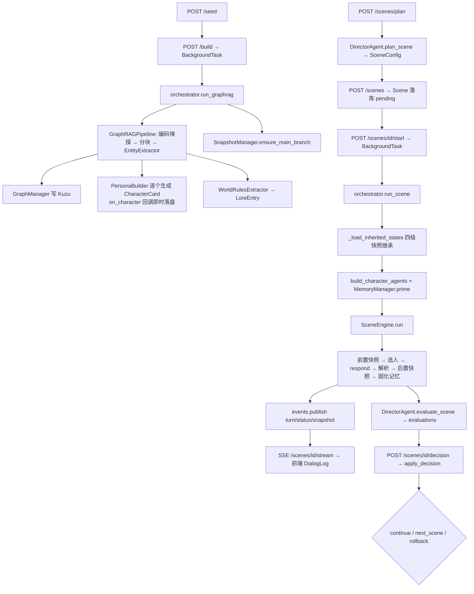

# CLAUDE.md — PlotSystem 根文档

> **本文件是 AI 编程助手进入本仓库的第一入口。**
> 它不是设计愿景书，而是一份**与代码对齐的地图 + 契约清单**。
> 当文档与代码冲突时，**以代码为准**，并顺手把本文档改对。

---

## 0. 阅读与使用约定

### 0.1 三类标记

全文所有描述必须落在以下三类之一，写新内容时也请沿用：

| 标记 | 含义 | 你该怎么做 |
|------|------|-----------|
| **【实况】** | 代码里真实存在且在运行路径上 | 可直接依赖，修改前先读对应文件 |
| **【契约】** | 不可破坏的架构红线 | 改动必须保持，破坏前先和人类确认 |
| **【设想】** | 尚未实现的规划 | **不要假装它存在**；要做时先补接口再实现 |

未标记的段落默认是【实况】。

### 0.2 文档体系

| 文件 | 面向 | 内容 |
|------|------|------|
| `CLAUDE.md`（本文件） | AI 助手 + 开发者 | 代码地图、数据契约、红线约束、已知缺陷、设想清单 |
| `README.md` | 人类 | 项目介绍、截图、快速启动 |
| `docs/fix-tickets/` | AI 助手 | 在途工单，每单自包含、可并行；索引见该目录 `README.md` |
| `.env.example` | 全体 | **配置项的唯一真值**，本文档不复制其内容 |
| `backend/models.py` | 全体 | **数据模型的唯一定义源**，本文档只讲语义与陷阱 |

### 0.3 给 AI 助手的硬性要求

1. 改代码前先看第 7 节【契约】，那 9 条是本系统的承重墙。
2. 改数据模型必须走第 5.4 节的三步 checklist，否则字段会静默丢失。
3. 第 12 节列出的"已知缺陷与 dead code"里的东西**不要顺手修**——除非工单要求，否则先问。
4. 不要为了"补齐文档"新建 md 文件；改动落到本文件对应章节即可。
5. 不新增核心依赖；确需新增，先在第 2 节登记。

---

## 1. 项目是什么

### 1.1 定位

PlotSystem 是一个**多分支、多智能体剧情推演系统**（科创项目）。

用户上传非结构化种子文本（小说 / 剧本 / 世界观设定），系统抽取实体建立知识图谱，
生成一批带**信息不对称**的角色智能体；随后由**导演智能体**按场次组织推演，
每场结束后评估并决策（继续 / 下一场 / 回滚）；全程以场次为单位自动打快照，
用户可从任意快照分叉出 IF 线；最后由总结智能体产出小说 / 剧本 / 报告。

### 1.2 血统与取舍（理解设计动机用）

| 来源 | 学到了什么 | 抛弃了什么 |
|------|-----------|-----------|
| **MiroFish**（原基座，多智能体群体模拟） | 多层记忆设计、实体抽取 → 图谱 → 智能体的整体流水线 | 强依赖 Zep（付费昂贵）；一切实体被拍平成"社交账号"（游戏剧情里的天灾也变成发帖账号）；快照/分支难做 |
| **SillyTavern**（角色扮演） | 角色卡（persona / speech_style）、lorebook 按关键词动态注入、持续上下文工程 | — |
| **"GPT 接入原神"类项目** | 长线任务与具体角色都由 AI 驱动，而非脚本 | — |

**因此本项目的形态是**：用户给大方向 → 导演做宏观调控 → 角色自然演绎。
不是剧本执行器，也不是社交模拟器。

> 【实况】CLAUDE.md 早期版本把 AutoGen / LlamaIndex / microsoft-graphrag 写成核心实现，
> 实际开发中三者均未接入运行路径（详见第 2 节）。这是开发期的技术选型演进结果，
> 不影响最终能力，**不要试图"修复"回去**。

### 1.3 真实工作流

```
① 上传种子文本  POST /projects/{id}/seed
② 触发构建      POST /projects/{id}/build   （后台任务）
        ↓  自研 LLM 抽取（非 microsoft/graphrag）
   实体 + 关系 → Kuzu 图谱
   角色实体     → CharacterCard（含 known_facts / unknown_facts）
   世界规则     → LoreEntry
   并创建 main 分支
③ 导演规划场景  POST /projects/{id}/scenes/plan  → SceneConfig（建议，不落库）
④ 创建场景      POST /projects/{id}/scenes       → Scene（落库，pending）
⑤ 开始模拟      POST /scenes/{id}/start          （后台任务 + SSE）
        ↓  前置快照 → 轮询发言 → 解析三态 → 终止判定 → 后置快照 → 记忆固化
⑥ 自动评估      DirectorAgent.evaluate_scene → evaluations 表 → SSE 推送
⑦ 导演决策      POST /scenes/{id}/decision
        ├─ continue   同场加轮次重跑
        ├─ next_scene 规划并创建新场景（可人工覆盖角色/地点/条件）
        └─ rollback   恢复快照 + 新建"回滚重演"场景
⑧ 生成输出      POST /projects/{id}/output  → 网文 / 剧本 / 舞台剧 / 报告 / 原始日志
```

### 1.4 设计信条

- **信息不对称是第一性的**：角色只能看到自己的 `known_facts`。公主不在朝堂，
  就该在与王子对话后才自然地表现出惊讶。这是本项目区别于普通群聊模拟的核心。
- **快照不追求确定性重放**：LLM 有随机性，回到快照重跑不会 100% 复现。
  快照的目的是 **"我能回到这里分叉 IF 线"** 和 **"演得不好能回来调"** ，不是版本控制。
- **导演宏观、角色微观**：导演不写台词，只搭场景、选人、评估、决策。
- **本地优先 / 优雅降级**：kuzu、chromadb、autogen 全部缺失时系统仍可跑（见【契约6】）。
- **编排集中**：所有跨模块调用只允许发生在 `backend/services/orchestrator.py`。

---

## 2. 技术栈实况

| 层次 | 实际使用 | 状态 | 说明 / 真实实现位置 |
|------|---------|------|--------------------|
| LLM 接入 | OpenAI 兼容 SDK + tenacity | ✅ 已接入 | `backend/utils/llm.py` 是**唯一出口** |
| 实体抽取 | 自研 LLM + JSON 提示词 | ✅ 已接入 | `graphrag_pipeline/entity_extractor.py` |
| 知识图谱 | Kuzu（嵌入式，Cypher） | ✅ 已接入 | `knowledge_graph/graph_manager.py`；缺失时降级为空图 |
| 向量记忆 | chromadb 原生 client + 远程 embedding | ✅ 已接入 | `memory/long_term.py` + `memory/embeddings.py` |
| 场景引擎 | **自研**手写对话循环 | ✅ 已接入 | `scene_engine/engine.py` |
| 后端 | FastAPI + Uvicorn + sse-starlette | ✅ 已接入 | `backend/main.py` |
| 持久化 | aiosqlite + JSON 文件树 | ✅ 已接入 | `utils/db.py` + `services/repository.py` |
| 前端 | Vue 3 + Vite + Pinia + Axios | ✅ 已接入 | `frontend/src/` |
| 图谱可视化 | AntV G6 | ✅ 已接入 | `GraphViewer.vue` / `GraphViewer2.vue` |
| **AutoGen** (`autogen-agentchat`) | 仅 `base_agent.py` 与 `CharacterAgent.get_autogen_agent()` | 🚫 **已评估，倾向不引入** | 无调用方。GroupChat 编排会打破【契约3】的 system 静态 / user 动态结构；未来的"角色动作交由环境智能体裁决"用 OpenAI 原生 function calling 即可，不需要 AutoGen |
| **LlamaIndex** | 无 | 🚫 **已评估，暂不引入** | 全仓库零 import。它对长期记忆的真实增量价值 = 时间衰减权重 + 混合检索(BM25) + 分层索引，这三项可在现有 Chroma 封装上手写，不必引入整个框架 |
| **microsoft/graphrag** | 无 | ❌ **未使用** | 已移入 `[project.optional-dependencies].graphrag` |

> 改 RAG 检索请改 `memory/long_term.py`；改实体抽取请改 `entity_extractor.py` 的提示词；
> 改发言顺序请改 `scene_engine/engine.py` 与 `scene_engine/speaker_selector.py`。
> **不要去找 GroupChat 或 settings.yaml。**

### 2.1 四路异构模型

`settings.director_model / character_model / summary_model / selector_model` 分别读
`LLM_MODEL_DIRECTOR / CHARACTER / SUMMARY / SELECTOR`，留空回退 `LLM_MODEL_NAME`。四者均已生效。

温度约定：角色 0.8（创意）、导演 0.3（一致）、总结 0.7（平衡）、选择器 0.2（判断）。

selector 另有独立的 `LLM_SELECTOR_BASE_URL / LLM_SELECTOR_API_KEY`（留空复用主配置），
用于把"发言者打分"这种短输入短输出的判断任务挂到本地小模型上。透传路径仍是
`utils/llm.py` 的 `chat()/chat_safe()` 的 `base_url` / `api_key` 参数，**契约7 未破**。

---

## 3. 代码地图

```
backend/
├── models.py           ★ 所有领域 dataclass 的唯一定义处
├── config.py           ★ pydantic-settings 单例 + 派生路径 + 三路模型属性
├── exceptions.py       业务异常树（ConflictError→409，其余 PlotSystemError→404）
├── main.py             FastAPI 装配 + 全局异常处理 + lifespan（init_db / 构建对账）
│
├── services/           ★★ 编排层：找业务逻辑先看这里
│   ├── orchestrator.py   唯一跨模块编排点（构建/规划/运行/决策/输出/对账）
│   ├── repository.py     唯一持久化出口（SQLite + 角色卡 JSON）
│   ├── inspection.py     ★ 角色内部状态的唯一只读查询层（面板/导演/总结共用）
│   └── events.py         SSE 内存事件总线（asyncio.Queue）
│
├── api/                路由层：只做参数校验 → 调 services → to_dict
│   projects / characters / scenes / director / branches / output / graph / schemas
│
├── agents/
│   ├── character_agent.py  角色演绎（prompt 构建 + 记忆检索 + chat_safe）
│   ├── director_agent.py   plan_scene / evaluate_scene / make_decision
│   ├── summary_agent.py    5 种格式输出
│   └── base_agent.py       AutoGen 模型客户端封装（⚠️ 无调用方）
│
├── scene_engine/
│   ├── engine.py           手写对话循环 + 三态解析 + 快照编排
│   ├── speaker_selector.py selector 模式的独立评分选人（工单11）
│   ├── termination.py      终止条件判定
│   └── scene_config.py     仅从 models.py 再导出
│
├── memory/
│   ├── memory_manager.py 三层门面
│   ├── short_term.py     deque 对话缓冲（纯内存）
│   ├── long_term.py      ChromaDB 向量库（可降级为字符重叠伪检索）
│   ├── episodic.py       关键词启发式的事件摘要（纯内存）
│   └── embeddings.py     RemoteEmbeddingFunction（替换 Chroma 默认本地 onnx 模型）
│
├── knowledge_graph/
│   ├── graph_manager.py  Kuzu 操作（同步 API 的 async 包装）
│   ├── schema.py         DDL
│   └── queries.py        ⚠️ dead code，零 import
│
├── snapshot/
│   ├── snapshot_manager.py 快照创建/恢复/删除 + 分支 fork + 分支树
│   ├── branch_tree.py      树结构组装
│   └── models.py           仅从 models.py 再导出
│
├── graphrag_pipeline/
│   ├── pipeline.py        分块 → 抽取 → 写图 → 生成角色卡 → 提取世界规则
│   ├── entity_extractor.py
│   ├── persona_builder.py
│   └── world_rules.py
│
└── utils/
    ├── llm.py         ★ LLM 唯一出口（chat / chat_safe / estimate_tokens）
    ├── db.py          SQLite DDL + 连接
    ├── serializer.py  to_dict（dataclass → JSON 安全字典）
    ├── logger.py
    └── init_db.py     `python -m backend.utils.init_db`

frontend/src/
├── pages/       Workspace.vue（项目+图谱） / Director.vue（分支树+日志+决策） / Output.vue
├── components/  GraphViewer.vue、GraphViewer2.vue、SceneTree.vue、
│                CharacterCard.vue、DialogLog.vue、DirectorPanel.vue
├── stores/      project.ts / characters.ts / scenes.ts / director.ts
├── router/index.ts、api/client.ts、types/index.ts、styles/global.css
```

**入口速查**：
- 想改「一场戏怎么演」→ `scene_engine/engine.py`
- 想改「角色说什么」→ `agents/character_agent.py`
- 想改「谁来演、演完怎么办」→ `services/orchestrator.py`
- 想改「存了什么」→ `services/repository.py` + `utils/db.py`
- 想加 API → `api/*.py`（**业务逻辑不要写在这层**）

---

## 4. 数据模型

> **唯一定义源：`backend/models.py`。** 这里只讲语义与陷阱，不复制字段清单。

### 4.1 模型总览

| 模型 | 作用 | 存放位置 |
|------|------|---------|
| `Project` | 推演项目 | SQLite `projects` |
| `CharacterCard` | 角色卡（persona + 信息不对称 + 关系 + 当前状态） | **文件** `characters/{cid}.json` |
| `CharacterState` | 角色在某时刻的快照态（含短期缓冲 / 事件摘要） | 快照目录 JSON |
| `CharacterInspection` | Inspection 层的只读组装结果（**不落库**） | 运行时 |
| `LoreEntry` | 世界观条目（keywords 触发、scope 控制可见范围、priority 排序） | 内嵌于角色卡 |
| `Scene` / `DialogueTurn` | 场景与对话轮次 | SQLite `scenes`（轮次内嵌） |
| `SceneConfig` | 导演规划产物（**不落库**，运行时构造） | — |
| `SceneEvaluation` | 四维评分 + 推荐决策 | SQLite `evaluations` |
| `DirectorDecision` | 导演决策 + 人工覆盖字段 | SQLite `decisions` |
| `Snapshot` / `Branch` / `BranchTree` | 快照与分支 | SQLite `snapshots`/`branches` + 快照目录 |
| `MemoryChunk` / `MemorySnapshot` | 记忆检索与序列化载体 | 运行时 |

### 4.2 容易踩的语义陷阱

1. **`Scene.snapshot_id_before` 为空是有意义的信号**：`SceneEngine.run()` 只有在它为空时
   才创建前置快照。回滚重演场景**必须**留空它，否则会跳过快照、丢掉新初始条件。
2. **`Scene.restore_snapshot_id` 与上者分工**：前者管"从哪儿回填运行时记忆"，
   后者管"要不要打快照"。两者不可合并。
3. **`Scene.speaker_mode` 与 `SceneConfig.speaker_mode` 是同一条链**（工单11 已打通）。
   缺省值来自 `settings.DEFAULT_SPEAKER_MODE`，由 `CreateSceneRequest` 或
   `DirectorAgent.plan_scene` 写入 `Scene`，再由 `run_scene` 传给 `SceneConfig`。
   **所有新建 `Scene` 的地方都要跟**——尤其是 `apply_decision` 的 rollback 分支，
   它手工构造重演场景，漏传就会让 selector 场景静默退回轮询。
   取值受两处校验保护：`CreateSceneRequest`（422）与 `Settings.DEFAULT_SPEAKER_MODE`
   （启动即失败）；`SceneEngine._select_speaker` 兜底回退 round_robin 时会 warning 一次。
4. **`DialogueTurn.selector_notice` 只在 selector 选人降级时非空**，内容是给前端
   在角色名后显示的一句灰字（服务不可用/部分打分失败）。它是展示用信号，
   不参与任何逻辑判断，也不进入角色 prompt。
5. **`CharacterState.long_term_memory_snapshot` 恒为空字符串**，`_collect_states()` 不写它。
6. **`DirectorDecision` 的 `next_*` 覆盖字段全为 `None` 时表示"保持 AI 自动规划"**，
   不要用空字符串/空列表当默认值。
7. **四维评分语义**：`narrative_goal` / `dramatic_tension` / `character_consistency` 越高越好；
   `plot_deviation` **越低越好**（0 = 完全贴合主线）。
8. **`SceneStatus.PAUSED` = “跑一半断了”**：运行异常、服务重启对账（见 6.4）都会落到这个状态。
   它不可提交决策（CAS 只接 completed），但可以再次 `POST /scenes/{id}/start` 续跑
   （`snapshot_id_before` 已存在→不重打快照，`dialogue_log` 已逐轮落盘→注入历史续接）。

---

## 5. 持久化契约 ★

> 这一节是最容易写出静默 bug 的地方，改数据相关代码前必读。

### 5.1 SQLite（`data/projects.db`，7 张表）

`projects` / `branches` / `scenes` / `snapshots` / `evaluations` / `decisions` / `outputs`

**【契约】统一模式：每张表的 `data_json` 列存放整个 dataclass 的 JSON，是唯一真相源；
`name` / `status` / `branch_id` / `created_at` 等列仅用于索引、过滤与 CAS。**

所有读取（`get_scene` / `list_projects` / ...）都从 `data_json` 反序列化。
只更新列而不更新 `data_json`，对 API 完全不可见。

**唯一例外**：`scenes.status` 列会承载 CAS 瞬态值 `deciding`，且**刻意不写入 `data_json`**
（见【契约5】）。因此该列的值域比 `SceneStatus` 枚举多一个。

### 5.2 文件系统 `data/projects/{project_id}/`

```
characters/{character_id}.json    ★ 角色卡不入库，走文件系统
seed_texts/                       原始种子文本
kuzu_db                           ⚠️ 当前 Kuzu 版本下是【单个文件】，不是目录
chroma_db/                        向量库
snapshots/{snapshot_id}/
    meta.json
    character_states/{cid}.json
    chroma_collections/
build_status.json                 构建进度（供重启后对账）
```

角色卡无 `delete_character`；删项目直接 `rmtree` 整个项目目录。

### 5.3 进程内易失状态

`_active_scenes`（并发守卫）、`_running_engines`（暂停/中断）、`_build_status`（有磁盘兜底）、
`events._subscribers`（SSE 订阅者）、每个 `MemoryManager` 的短期与事件记忆。

### 5.4 【契约】修改数据模型的三步 checklist

1. 改 `backend/models.py` 的 dataclass；
2. **同步改 `services/repository.py` 里对应的 `_deserialize_*`**（`_deserialize_card` /
   `_deserialize_scene` / 快照的 `_deserialize_character_state`）——漏这步字段会静默丢失；
3. 评估是否需要新增 SQL 列（只有需要索引/过滤/CAS 时才加，普通字段靠 `data_json` 自动携带）。

前端有对应类型时，同步改 `frontend/src/types/index.ts`。

---

## 6. 核心调用链



### 6.1 构建（`run_graphrag`）

后台任务。进度经 `_set_build_status` 同时写内存与 `build_status.json`。
角色卡在生成过程中通过 `on_character` 回调**逐个落盘**，前端轮询即可增量预览。
失败时把 stage 写成 `失败: xxx` 并把项目状态退回 `initializing`。

### 6.2 运行场景（`run_scene`）

1. `_active_scenes` 并发守卫（检查与写入之间无 `await`，依赖单线程事件循环原子性）；
2. `_load_inherited_states` 取运行时记忆；
3. `build_character_agents`：**每场新建** `CharacterAgent` + `MemoryManager`（无跨场复用），
   用 `prime()` 回填短期缓冲与事件摘要；长期记忆靠 ChromaDB 目录天然连续；
4. `SceneEngine.run(on_turn=...)`：前置快照 → `check_termination` → `_select_speaker`
   （`selector` 模式下转交 `ScoringSpeakerSelector`：每个候选各一次并行打分调用，
   叠加被点名加分与重复发言惩罚；兜底必须 warning 可见，不得静默选 `agents[0]`）
   → `agent.respond()` → 正则拆 `*动作*` / `[独白]` / 对白 → 追加 transcript
   → 对本场**全部参演角色**调 `add_experience`（在场即记忆，工单15；写他人轮次时
   剥离 `inner_thought`）→ SSE 推送；
5. 终止后先固化记忆（`consolidate(force=True)`，唯一写入点在第4步，不重复写入）
   → 再打后置快照（此时短期缓冲已清空，快照记录的是"已落库"的干净状态，
   供下一场 `prime()` 回填也不会重新引入已固化过的内容）。**顺序不可颠倒**：
   若先打快照再固化，快照里的短期缓冲会带着"即将被固化"的原始文本，
   一旦该快照被 continue/rollback/next_scene 用于 `prime()` 回填，
   这批已写入长期记忆的台词会在新场景的下一次 consolidate 时被二次写入；

6. orchestrator 落盘角色状态与 Scene → 推 snapshot 事件 → 自动评估落库 → 推 evaluation 与 completed。

**运行中的可恢复性（工单23）**：开跑前先把 `status=running` 落库；引擎每产生一轮就先把
`dialogue_log` / `turns_completed` 写回 `scene` 对象，再回调 `on_turn`，由 orchestrator **逐轮
`save_scene`** 后才推 SSE。因此中途刷新/断线/进程退出都能从 `GET /scenes/{id}` 拿回已产生的
轮次；运行失败时将场景置为 `paused` 并落库（否则永远卡在 running）。
**不要为了“减少写入”把逐轮落盘改回结束时一次性保存。**

**注意**：`SceneEngine` 不碰 SQLite，它把结果写回传入的 `Scene` 对象，由 orchestrator 负责落盘。

### 6.3 决策（`apply_decision`）

见【契约5】。三分支行为：

- **continue**：`max_turns = turns_completed + extra`（默认 6），状态改回 `pending`，
  `asyncio.create_task(run_scene)` 重跑。**不写 decisions 表**（开启新一轮生命周期）。
- **next_scene**：调 `plan_scene` 生成配置 → 应用人工覆盖（角色/地点/初始条件）
  → 建新场景并记录 `parent_scene_id` → 写 decisions 表。
- **rollback**：`restore_snapshot` → `_apply_character_states` 写回角色卡
  → 新建"（回滚重演）"场景，`snapshot_id_before=""`、`restore_snapshot_id=target`
  → 写 decisions 表。目标快照缺失时**不持久化决策**，允许用户补 ID 重试。

### 6.4 启动对账

`main.py` 的 lifespan 中调用两个对账函数：

- `reconcile_stale_builds()`：扫描所有 `build_status.json`，把进度在 (0,1) 且既非完成
  也非失败的状态标记为失败，避免前端无限轮询卡死；
- `reconcile_stale_scenes()`：把数据库里残留的 `running` 场景改为 `paused`。场景由后台
  任务驱动，进程一退出任务就没了（【契约9】单进程假设下，启动瞬间不可能有场景真在跑）。
  **只改状态，不自动重跑 LLM**——已产生的轮次都已逐轮落盘，由用户显式决定是否续跑。

### 6.5 Inspection（角色内部状态查询）

`services/inspection.py` 是**读角色内部状态的唯一路径**，用户面板 / 导演 / 总结智能体共用：

- `resolve_scene_states(scene, sm)`：契约4 四级快照继承的**唯一实现**，
  `orchestrator._load_inherited_states` 只是它的薄封装；
- `load_character_state(...)`：时点解析优先级 `snapshot_id` > `scene_id`（走上面四级链）
  > 该角色最近一次出现的快照（可用 `branch_id` 限定）；一个快照都没有时退回角色卡当前值，
  此时返回的来源 id 为空；
- `inspect_character(...)`：在上者基础上叠加角色卡人设与长期记忆检索，产出 `CharacterInspection`。
  `include_private=False` 会抹掉 `unknown_facts`——结果若可能进入角色可见上下文必须传 False（契约1）。
  长期记忆**只在显式给出检索词时**才查（避免面板每次打开都触发 embedding 调用）。

短期缓冲与事件摘要是纯内存态，只存在于快照里；这正是旧接口每次新建 `MemoryManager`
因而恒返回空的根因。注意后置快照是在 `consolidate` 之后打的（见 6.2），
所以已完成场景的快照里 `short_term_buffer` 为空是**正常**的，内容已进长期记忆。

---

## 7. 【契约】九条承重墙

改动触碰以下任意一条时，必须显式保持，破坏前先和人类确认。

### 契约 1 — 信息不对称（注意隔离边界）

**该隔离的**：
- `unknown_facts` 只允许出现在 `PersonaBuilder` 生成过程与面向导演/用户的 API 响应中，
  **绝不允许**进入 `CharacterAgent.build_system_prompt()`、`speaker_selector` 的打分 prompt
  或任何角色可见的上下文；
- 一个角色的 `inner_thought` 不得进入其他角色的 prompt；
- 角色不在场的场次里发生的信息（跨场次传播应走【设想】里的世界状态通道，不是直接给）。

**不该隔离的**：同一场景中在场角色的**公开发言与动作**。这些是共享感知，
每个在场角色都应该记住。

> ⚠️ 早期文档只写"角色只持有已知信息"，被误读成"不该记录他人发言"，
> 曾是"记忆只写发言者"那个 bug（工单15，已修复：`SceneEngine.run()` 现在对本场
> 全部参演角色写入每一轮，写他人轮次时剥离 `inner_thought`）的文档层成因。别再退回去。

### 契约 2 — 快照前置（含唯一例外）

场景模拟必须有前置快照。**唯一例外**：`scene.snapshot_id_before` 非空时（continue 续跑）
引擎刻意跳过创建，避免覆盖首次快照。这是特性不是 bug。

### 契约 3 — Prompt 前缀稳定（prefix cache）

`system` 消息只放**整场不变**的内容（人设 / 世界观 / 已知事实 / 关系 / 场景设定 / 格式规范）；
每轮变化的内容（目前对话、检索到的记忆、发言指令）一律放 `user` 消息，
且"目前对话"**只在末尾追加、不做逐行滑窗**——超出 `TRANSCRIPT_TOKEN_BUDGET` 时
成块丢弃并记录 `_transcript_start`。

目的：同一角色在同一场景内的 prompt 前缀保持稳定，命中服务端 prefix cache。
**任何"优化"都不得把变化内容塞回 system，也不得改成逐行滑窗。**

### 契约 4 — 运行时记忆继承链

短期缓冲与事件摘要是纯内存态，必须靠快照续命。`_load_inherited_states` 的四级优先级：

1. `snapshot_id_after`（本场跑过 → continue 续跑）
2. `restore_snapshot_id`（回滚重演）
3. `snapshot_id_before`（异常恢复）
4. 父场景的 `snapshot_id_after`（next_scene）

取到后经 `MemoryManager.prime()` 回填。**顺序不可调换。**

### 契约 5 — 幂等性是通用不变量

**任何可被用户重试 / 网络重放触发的写接口，都必须设计幂等键。**
这不是决策接口的局部规定，新增此类接口时同样适用。

当前决策接口的三件套实现（可作为模板）：

1. `decisions` 表（`scene_id` 主键 = 幂等键）持久化已生效决策 → 重试/重放返回同一
   `next_scene_id`，不重复调 LLM、不重复建场景；提交不同 `decision_type` 抛 `ConflictError`(409)。
2. `scenes.status` 的 CAS 条件更新 `completed → deciding` 拦截并发，
   靠 SQLite 写锁跨进程有效；**只写列不写 `data_json`**。
3. `finally: clear_scene_deciding` 释放守卫（仅当仍为 `deciding` 时恢复 `completed`）。

`continue` 刻意不落表。已知边界：极晚到达的 continue 重试会再次续跑（确定性、不分叉，可接受）。

### 契约 6 — 优雅降级

`kuzu` / `chromadb` / `autogen` 全部走 try-import + `_XXX_AVAILABLE` 分支，
缺失时降级（空图 / 字符重叠伪检索 / 不可用）。**离线与 CI 环境必须能跑通。**
新增可选重依赖时沿用同一模式。

### 契约 7 — LLM 唯一出口

所有 LLM 调用必须经 `backend/utils/llm.py` 的 `chat()` / `chat_safe()`
（tenacity 3 次指数退避、180s 超时、失败转 `LLMError`）。
**禁止**在其他模块直接实例化 OpenAI 客户端——唯一例外是 `memory/embeddings.py`
（Chroma 要求同步接口）。模型名一律走 `settings`，禁止硬编码。

### 契约 8 — 分层边界

- `api/` 只做参数校验 → 调 `services` → `to_dict`，**不写业务逻辑**；
- 跨模块编排只在 `services/orchestrator.py`；
- 写 SQLite 与角色 JSON 只在 `services/repository.py`；
- 不在模块间传递 Kuzu / Chroma 的原始连接对象。

### 契约 9 — 单进程假设

`_active_scenes` 与 SSE 事件总线都是进程内的，**当前部署必须单 worker**。
多 worker 会破坏场景并发守卫与 SSE 投递（决策幂等因走 DB CAS 不受影响）。
要上多 worker 需先把这两处外置。

---

## 8. API 实况

统一前缀 `/api/v1`（`main.py::API_PREFIX`）。统一响应包络：

```json
{ "success": true, "data": {}, "error": null, "timestamp": "..." }
```

异常映射：`ConflictError` → 409，其余 `PlotSystemError` → 404（`main.py` 全局处理器）。

| 方法 | 路径 | 说明 |
|------|------|------|
| GET | `/health` | 健康检查 |
| POST / GET | `/projects` | 创建 / 列出项目 |
| GET / DELETE | `/projects/{project_id}` | 详情 / 删除（连带 `rmtree` 项目目录） |
| POST | `/projects/{project_id}/seed` | 上传种子文本（multipart） |
| POST | `/projects/{project_id}/build` | 触发构建（后台任务） |
| GET | `/projects/{project_id}/build/status` | 构建进度 |
| GET | `/projects/{project_id}/graph` | 图谱可视化数据 |
| GET | `/projects/{project_id}/characters` | 角色列表 |
| GET / PATCH | `/projects/{project_id}/characters/{char_id}` | 角色详情 / 人工编辑 |
| GET | `/projects/{project_id}/characters/{char_id}/memory` | 运行时记忆（短期缓冲 + 事件摘要），读自快照 |
| GET | `/projects/{project_id}/characters/{char_id}/inspect` | 角色内部视图（人设 + 时点状态 + 三层记忆） |
| POST | `/projects/{project_id}/scenes/plan` | 导演规划，返回 SceneConfig（**不落库**） |
| POST | `/projects/{project_id}/scenes` | 创建场景 |
| GET | `/projects/{project_id}/scenes` | 列出场景（`?branch_id=` 可选），前端刷新后恢复导航用 |
| GET | `/projects/{project_id}/scenes/{scene_id}` | 场景详情 |
| GET | `/scenes/{scene_id}` | 场景详情（无需 project_id） |
| POST | `/scenes/{scene_id}/start` | 开始模拟（后台任务）。已在跑→`already_running`；已完成→`already_completed`（不重跑） |
| POST | `/scenes/{scene_id}/pause` | 中断运行中的引擎 |
| GET | `/scenes/{scene_id}/log` | 完整对话日志 |
| GET | `/scenes/{scene_id}/stream` | **SSE** 实时流 |
| GET | `/scenes/{scene_id}/evaluation` | 导演评估 |
| GET / POST | `/scenes/{scene_id}/decision` | 查询已生效决策（幂等重放） / 提交决策 |
| GET | `/projects/{project_id}/branches` | 分支树 |
| GET | `/projects/{project_id}/snapshots` | 快照列表（只返回元信息，不带角色状态明细） |
| POST | `/snapshots/{snapshot_id}/fork` | 从快照分叉（**需 `project_id` query 参数**） |
| DELETE | `/snapshots/{snapshot_id}` | 删除快照（**需 `project_id` query 参数**） |
| POST | `/projects/{project_id}/output` | 生成输出 |
| GET | `/output/{output_id}` | 取回生成结果 |

**SSE 事件类型**：`turn`（新 DialogueTurn）、`status`、`snapshot`、`evaluation`、`error`。
订阅建立时后端会**先回放一帧 `status`**（带 `initial: true`）告知当前状态，
让重连的客户端（以及“刚好在订阅前跑完”的竞态）不会挂死在“模拟中”；
`completed` / `paused` 两个终态会结束流。

---

## 9. 前端实况

| 页面 | 路由 | 功能 |
|------|------|------|
| `Workspace.vue` | `/` | 项目管理、种子上传、构建进度轮询、G6 图谱 |
| `Director.vue` | `/director/:projectId` | 分支树、本分支场景列表、场景配置、SSE 实时日志、决策面板、快照面板 |
| `Output.vue` | `/output/:projectId` | 选分支 + 选格式 → 预览导出 |

要点：

- **SSE 双保险**：`joinScene` 先用已持久化的 `dialogue_log` 铺底，
  `startSimulation({keepLog})` 保留续跑日志，场景完成后 `reconcileLog()` 补齐
  SSE 建立前遗漏的轮次。改动实时日志逻辑时别破坏这个对账。
- **`attachScene` 与 `joinScene` 不可混用**：前者用于“打开/重连已存在的场景”（刷新恢复、
  点选历史场景），**绝不调 `/start`**；后者用于决策产生的新场景/续跑，会调 `/start`。
  对已完成场景误调 `/start` 会白烧一整场 LLM 并覆盖快照/评估（后端已加拦截，但前端不该依赖它）。
- **刷新恢复链**：URL query `?scene=` 记录当前场景 → `onMounted` 优先 attach 它，
  否则退到该分支最后一场；评估与已生效决策分别由 `GET /evaluation` 与 `GET /decision` 回填。
- `GraphViewer.vue` 与 `GraphViewer2.vue` 并存，由 `graphViewerVersion` 切换。
- `SceneTree.vue` 是纯 `h()` 渲染的嵌套列表（**不是 G6**），节点是 **Branch** 不是 Scene，
  仅 emit 选中的 `branch_id`。
- 样式：暗色卡片风。主色 `#1a1a2e` / `#16213e` / `#0f3460`，高亮 `#e94560`。
- 数据模型变更需同步 `frontend/src/types/index.ts`。

---

## 10. 开发规范

### 10.1 Python

- 公共函数必须完整类型注解；文件头 `from __future__ import annotations`。
- 所有 IO（LLM / DB / 文件）必须 `async`；禁止 `time.sleep`。
- 内部数据用 `@dataclass`（集中在 `models.py`），跨 API 边界用 Pydantic（`api/schemas.py`）。
- 异常继承 `PlotSystemError`（`exceptions.py`），不要裸 `raise Exception`。
- `ruff` 通过（配置见 `pyproject.toml`，已忽略 UP042）。

### 10.2 命名

类 `PascalCase`；函数/变量 `snake_case`；常量 `UPPER_SNAKE`；
API 路径参数与 DB 字段 `snake_case`；Vue 组件 `PascalCase`，脚本内 `camelCase`。

### 10.3 提交与测试

- Conventional Commits：`feat(agents): ...` / `fix(scene): ...` / `docs: ...`。
- 核心模块（agents / snapshot / memory / orchestrator）新功能需附单测。
- `tests/conftest.py` 会把 `DATA_DIR` 指向临时目录，测试不会污染 `data/`。
- 端到端手测：`python -m scripts.run_demo`。

### 10.4 注释

业务语义注释用中文；只写"代码本身看不出来的信息"（为什么这么做、哪条契约在起作用），
不要复述下一行在干什么。

---

## 11. 环境与启动

配置项的**唯一真值是 `.env.example`**，本文档不复制。只强调：

- 三路模型 `LLM_MODEL_DIRECTOR / CHARACTER / SUMMARY` 留空即回退 `LLM_MODEL_NAME`。
- `EMBEDDING_API_KEY / EMBEDDING_BASE_URL` 留空即复用 LLM 的那套。
  **换 embedding 模型必须清空 `chroma_db/`**，否则维度不一致。
- `GRAPHRAG_LLM_MODEL` 已弃用，代码从不读取。

```bash
uv sync                       # 或 pip install -e ".[dev]"
cd frontend && npm install
python -m backend.utils.init_db

npm run dev        # 前后端同时起
npm run backend    # FastAPI  http://localhost:5001
npm run frontend   # Vite     http://localhost:3000
```

Python 要求 `>=3.11,<3.13`。生产/演示部署**必须单 worker**（见【契约9】）。

---

## 12. 已知缺陷与 dead code

> **这一节的东西不要顺手"修复"。** 它们要么无人使用、要么已有工单在跟。
> 确实要动，先确认属于当前工单范围。

### 12.1 已知缺陷（真 bug，有工单或待排期）

| 缺陷 | 现象 | 备注 |
|------|------|------|
| —— | 暂无 | 图谱快照 `copytree` 与前端未消费 `GET /decision` 两项已修复 |

### 12.2 Dead code（存在但零调用）

- `knowledge_graph/queries.py` —— 全仓库零 import。
- `agents/base_agent.py` 的 AutoGen 封装 + `CharacterAgent.get_autogen_agent()` —— 无调用方。
- `DirectorAgent.query_graph()` —— 零调用；且传入的 `GraphManager` 从未 `connect()`，
  真调用会报错。**导演目前仍不读图谱**，只吃角色卡与对白文本
  （`query_character_state()` 已在工单17 落地到 Inspection 层，不再是死代码）。
- `MemoryManager.snapshot()` / `restore()` —— 零调用。真实快照路径是
  `SceneEngine._collect_states()` 直接读 `short_term.dump()` / `episodic.dump()`，
  恢复路径是 `_load_inherited_states()` + `MemoryManager.prime()`。
- `CharacterState.long_term_memory_snapshot` —— 恒为空字符串。
- `settings.GRAPHRAG_LLM_MODEL` —— 从不读取。
- `scene_engine/scene_config.py`、`snapshot/models.py` —— 仅从 `models.py` 再导出，
  保留是为了 import 路径兼容，**不要往里加定义**。

---

## 13. 【设想】尚未实现的规划

> 以下全部**尚不存在于代码中**，且多数**尚未立项**。此处只做集中登记，防止在别处
> 被误当成现状引用；真正要做时先去 `docs/fix-tickets/` 开单、先补接口再实现。

| 设想 | 想解决什么 | 工单 / 状态 |
|------|-----------|------------|
| **环境智能体** | 裁决介于"角色动作"与"环境变量"之间的判定。例：配角想拔石中剑 → 判定"没拔动"；角色触碰祭祀水盆 → 展示其特殊功能。实现走 OpenAI 原生 function calling，**不需要 AutoGen** | `11-...`；会改动 SceneEngine 对话循环本身，建议作为独立大提案最后做 |
| **世界状态 / 事件变量** | 跨场次的信息传递通道。信息不对称保证"角色不该知道的不知道"，世界状态负责"该传播的能传播"（含环境层跨场景广播） | `07-world-state.md` |
| **私有内心 OS** | 角色输出前的自适应思考，**不入档**——与现在会落档的 `inner_thought` 是两回事 | 未立项 |
| **分镜稿（storyboard）** | 导演当前只有提示词 + 压缩后的既往剧情，长线维持能力弱。设想给导演一份可读写的持久化文件（类似 AI 的记忆文件），随快照一起版本化；分支时需向导演说明差异 | 未立项 |
| **AutoPilot 模式** | 自动采纳导演建议的决策，无人值守连跑多场 | `12-auto-pilot-director.md`（依赖工单 13，已完成） |
| **MCTS / 多结局** | 当前"每次只生成一场 + 采纳导演建议" ≈ 已默认剪枝的单条路径；多结局靠人工从快照分叉。待场景评价与分镜稿都持久化后，可在其上做真正的搜索 | 未立项 |

**关于项目书里的"多结局与 MCTS"**：不要把它理解成已实现的搜索算法。
当前是「贪心单路径 + 人工分叉」，这是有意为之的成本取舍。

---

## 14. 文档维护规则

以下情况**必须**同步更新本文件：

- 新增/移除核心依赖 → 第 2 节
- 目录结构变化 → 第 3 节
- 数据模型字段变化 → 第 4 节 + 走 5.4 checklist
- 新增/修改 API → 第 8 节
- 触碰第 7 节任一契约 → 更新契约描述并说明理由
- 修掉第 12 节的缺陷 / 落地第 13 节的设想 → 把条目从对应清单里删掉，
  并把内容升格到正文（【设想】→【实况】）

**不要**新建"变更说明.md""重构总结.md"之类的文件；改动落到对应章节即可。
在途任务写进 `docs/fix-tickets/`，完成后更新该目录的 `README.md` 索引。

<!-- 变更记录 -->
<!-- 2026-05-29: 初始版本（设计规范导向） -->
<!-- 2026-05-30 ~ 2026-07-28: 骨架落地、决策幂等（工单13）、运行时记忆续跑（工单14） -->
<!-- 2026-08-01: 基于代码审计彻底重写。文档定位从"设计愿景规范"改为
     "与代码对齐的地图 + 契约清单"：
     - 引入【实况】/【契约】/【设想】三类标记，杜绝把未实现内容写成现状
     - 移除 AutoGen GroupChat / LlamaIndex / microsoft-graphrag 的失实描述
     - 补齐 services 编排层、models.py、持久化 data_json 真相源契约
     - 新增第 12 节「已知缺陷与 dead code」防止误修，第 13 节收拢全部设想
-->
<!-- 2026-08-02: 工单11（Selector 打通）落地。speaker_mode 断链修复，
     新增 scene_engine/speaker_selector.py（独立评分选人 + 点名加分 + 重复惩罚），
     异构模型扩为四路（新增 selector，含独立 base_url/api_key）。
     对应删除 12.1 的 speaker_mode 断链条目与 13 的「Selector 打通」设想。
-->
<!-- 2026-08-02: PR review 修复。rollback 重演场景补传 speaker_mode；
     speaker_mode 增加取值校验（API 422 / 配置启动即失败 / 引擎兜底 warning）；
     新增 DialogueTurn.selector_notice，selector 降级时前端在角色名后灰字提示。
-->
<!-- 2026-08-04: 工单17（统一 Inspection 层）落地。新增 services/inspection.py
     与 CharacterInspection 模型、GET /characters/{id}/inspect；修掉
     GET /characters/{id}/memory 恒空（改读快照）；DirectorAgent.query_character_state
     由空壳落地到该层；orchestrator._load_inherited_states 改为薄封装。
     对应删除 12.1 的 memory 恒空条目、12.2 的 query_character_state、
     13 的「统一 Inspection API 层」设想；新增 6.5 节。
-->
<!-- 2026-08-25: 运行中场景可恢复 + 快照可用化。
     后端：engine 每轮先写回 scene 再回调 → orchestrator 逐轮 save_scene；
     开跑即落库 running、失败落库 paused；新增 reconcile_stale_scenes（lifespan 调用）；
     新增 GET /projects/{id}/scenes；start 拒绝已完成场景；SSE 订阅首帧回放状态；
     快照列表瘦身为元信息；修复 GraphManager.checkpoint_to/restore_from 对单文件
     kuzu_db 必炸的问题（12.1 原第一条）。
     前端：scenes store 拆出 attachScene（只重连不 start）/resumeScene，消费
     GET /decision；Director.vue 增加本分支场景列表、快照面板（分叉/删除）、
     ?scene= 刷新恢复；DirectorPanel 支持选择回滚目标快照并在已决策时锁定按钮。
-->
