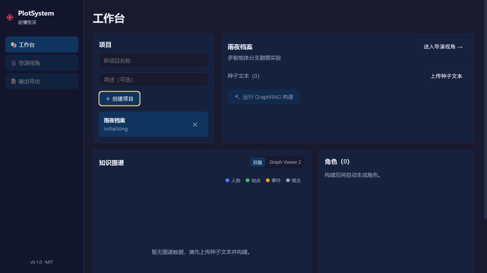
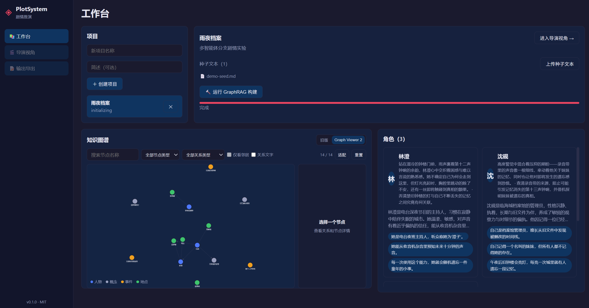
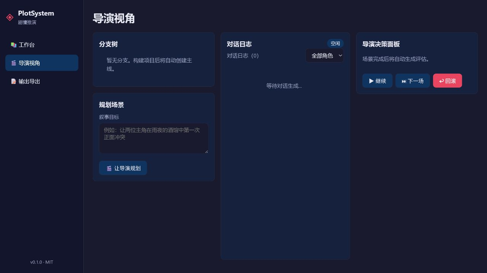
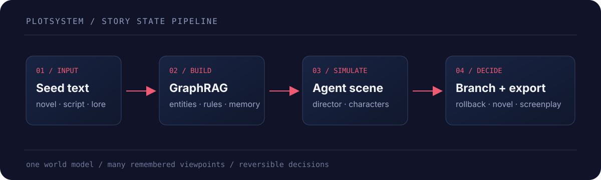

# PlotSystem

<p align="center">
  <strong>多智能体、可分支的剧情推演工作台</strong><br>
  将种子文本变成可追溯的世界模型，让拥有独立记忆与信息视角的角色在场景中行动。
</p>

<p align="center">
  <code>GraphRAG</code>&nbsp;&nbsp; <code>Character Agents</code>&nbsp;&nbsp; <code>Branching Scenes</code>&nbsp;&nbsp; <code>Exportable Outputs</code>
</p>

PlotSystem 面向小说、影视剧本和世界观创作者：先导入一组种子文本，再由 GraphRAG 整理实体、关系与规则；导演智能体负责规划场景，角色智能体在各自的记忆和信息不对称下推进对话，重要决策可以分叉、回滚，并最终导出为可阅读的成品。

## 真实界面

下面的图片来自本地运行的 Vue 前端，而不是概念 mock。

<p align="center">
  
</p>

<p align="center"><sub>工作台：创建项目、管理种子文本、启动 GraphRAG 构建，并查看知识图谱与角色卡生成区域。</sub></p>

<p align="center">
  
</p>

<p align="center"><sub>真实上传状态：示例种子文本已进入项目，GraphRAG 构建入口随之可用。</sub></p>

<p align="center">
  
</p>

<p align="center"><sub>导演视角：把叙事目标交给导演智能体，观察对话推进，并通过继续、下一场或回滚控制分支。</sub></p>

## 工作机制

<p align="center">
  
</p>

| 阶段 | PlotSystem 做什么 | 产物 |
| --- | --- | --- |
| 输入 | 接收 `.txt` / `.md` 种子文本 | 世界观、人物设定、剧情线索 |
| 建模 | 用 GraphRAG 抽取实体、关系和世界规则 | Kuzu 知识图谱 + ChromaDB 长期记忆 |
| 推演 | 由 DirectorAgent 规划场景，CharacterAgent 以独立记忆参与互动 | 对话日志、场景状态、分支快照 |
| 决策 | 继续当前场景、创建分支或回滚到快照 | 可比较、可恢复的剧情路径 |
| 输出 | 选择分支并生成目标格式 | 网文、影视剧本、舞台剧本或推演报告 |

## 快速开始

### 1. 安装依赖

```bash
uv sync
npm install --prefix frontend
```
此外
```bash
# 或使用pip (推荐uv)
pip install -e ".[dev]"
# 此外可能需要安装concurrently
npm install concurrently
```

如需可选的 Microsoft GraphRAG 依赖：

```bash
uv sync --extra graphrag
```

### 2. 配置模型服务

```bash
cp .env.example .env
```

至少填写以下变量：

```dotenv
LLM_API_KEY=your_api_key_here
LLM_BASE_URL=https://api.siliconflow.cn/v1
LLM_MODEL_NAME=deepseek-ai/DeepSeek-V4-Flash
```

Embedding 服务可以复用同一套 API；需要独立服务时，再填写 `EMBEDDING_API_KEY` 和 `EMBEDDING_BASE_URL`。

### 3. 初始化并启动

```bash
python -m backend.utils.init_db
npm run dev
```

打开 [http://localhost:3000](http://localhost:3000)。前端开发服务器运行在 `3000`，FastAPI 后端运行在 `5001`。

首次使用时，在工作台创建项目并上传 `.txt` 或 `.md` 种子文本，然后运行 **GraphRAG 构建**。构建完成后，知识图谱和角色卡会出现在工作台，导演视角会自动拥有可推进的主线。

也可以分开启动：

```bash
npm run backend
npm run frontend
```

### CLI 演示

```bash
python -m scripts.run_demo
```

## 页面入口

| 页面 | 用途 |
| --- | --- |
| `/` | 创建项目、上传种子文本、运行构建、查看图谱与角色 |
| `/director/:projectId` | 规划场景、查看对话、推进或回滚剧情分支 |
| `/output/:projectId` | 选择分支并导出网文、剧本、舞台剧或报告 |

## 技术栈

- **Frontend**：Vue 3、Vite、Pinia、AntV G6
- **Backend**：FastAPI、Uvicorn
- **Agents**：DirectorAgent、CharacterAgent、SummaryAgent
- **Memory & Graph**：LlamaIndex、ChromaDB、Kuzu
- **Optional pipeline**：Microsoft GraphRAG

## 项目结构

```text
backend/       FastAPI、智能体、记忆、图谱与场景引擎
frontend/      Vue 工作台、导演视角与输出页面
scripts/       CLI 演示与维护脚本
tests/         后端与场景行为测试
docs/          设计说明、fixture 与修复记录
```

完整的工程约定和实现说明见 [`CLAUDE.md`](./CLAUDE.md)。

