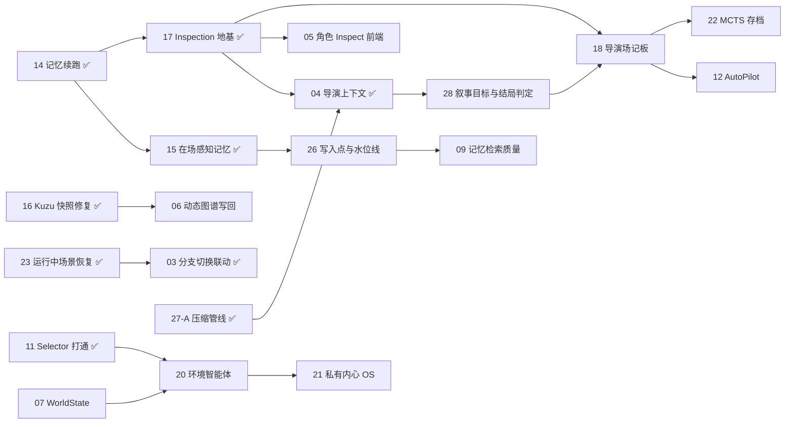

# PlotSystem 工单索引

> **本文件只做一件事：列出所有工单及其当前状态。**
> 规则与长说明已拆到配套文档，新增内容请写进对应文件，不要堆回本表下方。

| 想找什么 | 去哪 |
|---|---|
| 工单流程、状态口径、hash 与收尾规则 | [CONVENTIONS.md](./CONVENTIONS.md) |
| 排期理由、拆分决策、已合并 PR 的结论与教训 | [NOTES.md](./NOTES.md) |
| 项目背景速览（给不熟悉本项目的 session） | [NOTES.md#bg](./NOTES.md#bg) |
| 架构契约、数据模型、已知缺陷与 dead code | [CLAUDE.md](../../CLAUDE.md) |

**状态图例**：`待处理` / `待建单`（未开工） · `⏳ 等待 PR（分支）` · `🔍 审核中（PR #N）` ·
`✅ PR #N（合入 main：起始hash到结束hash）`。完整口径与 hash 填写规则见
[CONVENTIONS.md](./CONVENTIONS.md)。**索引标注可能滞后于实际合并状态，以 git 为准。**

**当前推进中**：工单 28（叙事目标与结局判定），从 main 开分支。

---

## 0. 已完成（不再排期）

| 编号 | 标题 | 状态 |
|---|---|---|
| [01](./01-rollback-fix.md) | 修复导演回滚决策断点 | ✅ 分支 `fix/rollback-build-status` |
| [02](./02-embedding-remote.md) | 长期记忆接入远程 Embedding | ✅ PR #4（合入 main：`c49f3d7` + `f5e7df6`） |
| [10](./10-scene-start-idempotency.md) | 重复点击"开始模拟"导致并发分叉 | ✅ PR #3 |
| [13](./13-decision-idempotency-and-scope.md) | 决策接口幂等 + "下一场"可编辑范围 | ✅ PR #5 |
| [14](./14-continuity-memory-context.md) | 续跑/回滚运行时记忆丢失 + 上下文窗口 | ✅ PR #7（合入 main：`0d17d2c`到`d96bee1`） |
| [15](./15-perceived-memory-and-dedup.md) | 记忆写入范围改为「在场感知」+ 同句去重 | ✅ PR #9（合入 main：`4b55561`到`9e3b444`） |
| GH#13 | 角色情感/目标/位置/关系在快照还原时未同步到智能体 ¹ | ✅ PR #14（合入 main：合并提交 `7707248`，内容提交 `875fe25`，外部贡献者 ParaNoite） |

¹ 工单 14 / 17 上线后发现的遗漏，**不属于本索引 01–22 编号**，用 GitHub Issue 号区分，
避免与工单 13「决策幂等」的文件混淆。

---

## 1. 阶段 A — 框架欠债（**先做**，否则后续功能建在流沙上）

| 编号 | 标题 | 优先级 | 依赖 | 状态 | 备注 |
|---|---|---|---|---|---|
| [11](./11-selector-and-world-interaction.md) | 打通 Selector 发言模式（已瘦身） | P1 | 无 | ✅ PR #10（合入 main：`56c97c1`到`c95f2c9`） | [拆分与实现方案](./NOTES.md#t11) |
| 16 | 修复 Kuzu 快照持久化（单文件 vs `copytree`） | P1 | 无 | ✅ PR #15（合入 main：`71f3a06`到`14bb500`） | [缺陷与修复](./NOTES.md#t16) |
| [23](./23-running-scene-recovery.md) | 运行中场景持久化与断线恢复 | P1 | 10 ✅、13 ✅、14 ✅ | ✅ PR #15（同上） | [合并理由](./NOTES.md#pr15) |
| [03](./03-branch-switch-frontend.md) | 前端分支切换无联动 | P1 | 无 | ✅ PR #15（同上；可选项 6 `Branch.scenes` 回写未做） | [同上](./NOTES.md#pr15) |
| 19 | 前端消费 `GET /scenes/{id}/decision` | P2 | 13 ✅ | ✅ PR #15（同上） | [同上](./NOTES.md#pr15) |

---

## 2. 阶段 B — 能力地基（多个上层功能共用）

| 编号 | 标题 | 优先级 | 依赖 | 状态 | 备注 |
|---|---|---|---|---|---|
| 17 | 统一 Inspection API 层（角色情绪/记忆/位置/内心的查询与微调） | P1 | 14 ✅ | ✅ PR #12（合入 main：`0dcd507`到`78c2b46`） | [为何提前 + 落地内容](./NOTES.md#t17) |
| [27](./27-context-compaction.md) | 统一上下文压缩管线（27-A） | P1 | 无 | ✅ PR #17（合入 main：`973c350`到`71d6f24`；27-B 未做） | [落地与 review 教训](./NOTES.md#pr17) |
| [04](./04-director-context.md) | 补全导演评估上下文 + P0 bug 清扫 | P1 | 17 ✅、27 ✅ | ✅ PR #17（同上） | [三层目标模型](./NOTES.md#director-goal) |
| [08](./08-fork-branch-conditions.md) | 分叉（fork）语义收敛 | P2 | 01 ✅、13 ✅、14 ✅、17 ✅ | ✅ PR #16（合入 main：`3f8d4d7`，阶段 A+B） | [两轮 review 教训](./NOTES.md#t08) |
| [28](./28-narrative-goal-and-ending.md) | 项目叙事目标持久化 + 结局判定 | **P1** | 04 ✅ | **待处理（下一个开工）** | [三层目标模型 + 两条禁令](./NOTES.md#director-goal) |
| [05](./05-character-inspector.md) | 角色 Inspect 前端入口 | P1 | 17 ✅、04 ✅ | 待处理（17 已带最小只读面板，本单只剩编辑/微调与更完整展示） | — |
| [07](./07-world-state.md) | WorldState 动态世界变量（跨场次信息传递通道） | P2 | 01 ✅ | 待处理 | [契约 3 补充条款待裁定](./NOTES.md#contract3) |
| [06](./06-dynamic-graph-writeback.md) | 场景结束后动态回写知识图谱 | P2 | 16 ✅（硬前置） | 待处理 | [硬前置已解除](./NOTES.md#t16) |

---

## 3. 阶段 C — 新功能

| 编号 | 标题 | 优先级 | 依赖 | 状态 | 备注 |
|---|---|---|---|---|---|
| 18 | 导演场记板 / 分镜稿（storyboard）持久化 | P2 | 17 ✅、28 | 待建单 | [说明](./NOTES.md#t18) |
| [26](./26-memory-write-watermark.md) | 记忆写入点与固化水位线统一 | P2 | 无 | 待处理（**须排在 09 之前**） | [说明](./NOTES.md#t26) |
| [12](./12-auto-pilot-director.md) | Auto Pilot（自动执行导演决策，无人值守连跑） | P2 | 13 ✅；18 可选 | 待处理 | — |
| [09](./09-memory-quality-optional.md) | 记忆检索质量优化（时间衰减 / BM25 混合 / 中文分词降级） | P3 | 02 ✅、15 ✅、26 | 待处理 | [前置说明](./NOTES.md#t09) |

---

## 4. 阶段 D — 大提案（改动核心循环，放最后）

| 编号 | 标题 | 优先级 | 依赖 | 状态 | 备注 |
|---|---|---|---|---|---|
| 20 | 环境智能体（裁决角色动作与环境规则） | P3 | 07、11 ✅ | 待建单 | [为何排最后](./NOTES.md#t20) · [契约 3 待裁定](./NOTES.md#contract3) |
| 21 | 私有内心 OS（角色输出前的自适应思考，**不入档**） | P3 | 20 | 待建单 | [说明](./NOTES.md#t21) |
| 22 | 评估 + 分镜稿存档 → 支撑 MCTS / 多结局搜索 | P3 | 18 | 待建单 | [说明](./NOTES.md#t22) |

**其他待建单**（尚未进表）：24 结构化动作通道（20 与 06 的共同前置，只解析不裁决）、
25 场景级 token/调用计数（20 的软前置）。

---

## 5. 依赖关系速览

