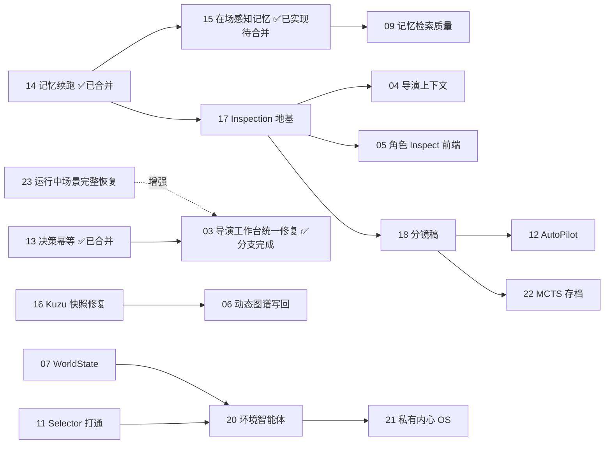

# PlotSystem 工单索引 v2（重排版）

> 本目录下每份文档都是一个**独立、自包含**的修复工单，可以单独分发给任意 AI 编程助手 session 处理，
> 不依赖其他工单或历史对话上下文。每份工单包含：问题背景、精确错误位置、目标（Definition of Done）、
> 涉及文件、建议实现步骤、验收方式。
>
> 本文件是工单**索引**（2026-08-01 重排版，替代早期版本）：合并了拆分错位的工单、补入了此前只存在于
> 讨论中的新功能，并按「先还框架债、再打地基、最后上新能力」重新排序。
>
> 编号规则：01–15 沿用原编号与原文件；**16 起为新增，文件尚未创建（标注「待建单」）**。
> 各工单除标注依赖外仍可并行。架构改动须与根目录 `CLAUDE.md` 保持一致。

### 工单状态约定

状态列使用以下格式，避免把“已实现”“已合并”“等待审核”混为一谈：

| 状态 | 含义 |
|---|---|
| `⏳ 等待 PR（分支）` | 改动已在指定分支完成，尚未创建 PR。 |
| `🔍 审核中（PR #N）` | PR 已创建，正在审核或等待合并。 |
| `✅ PR #N（提交范围）` | PR 已合入；提交范围可选，但当 rebase 造成线性历史、难以从日志辨认归属时必须填写。 |

`待处理`、`待建单` 继续表示尚未进入开发。分支、PR 编号和提交范围均应以实际 Git/GitHub 状态为准，更新工单状态时同步更新本索引。 如果因为gh.exe没有登录无法核实 提醒用户进行操作或检查即可

开工流程约定：开始改动前先 `git checkout -b` 建分支，改完立即 commit 到该分支，
不要把改动堆积在 `main` 上等最后再一次性搬迁——避免与他人并行改动冲突，也让状态列的
「⏳ 等待 PR（分支）」在任意时刻都能对应到一个真实存在的分支。

---

## 0. 已完成（不再排期）

| 编号 | 标题 | 归档说明 |
|---|---|---|
| 01 | 修复导演回滚决策断点 | ✅ 分支 `fix/rollback-build-status` |
| 02 | 长期记忆接入远程 Embedding | ✅ PR #4（合入 main：`c49f3d7` + `f5e7df6`） |
| 10 | 重复点击"开始模拟"导致并发分叉 | ✅ PR #3 |
| 13 | 决策接口幂等 + "下一场"可编辑范围 | ✅ PR #5 |
| 14 | 续跑/回滚运行时记忆丢失 + 上下文窗口 | ✅ 已合并（PR #7，`0d17d2c`到`d96bee1`） |
| 15 | 记忆写入范围改为「在场感知」+ 同句去重 | ✅ PR #9 (`26cfc53`到`2d99d71`) |

---

## 1. 阶段 A — 框架欠债（**先做**，否则后续功能建在流沙上）

| 编号 | 标题 | 优先级 | 依赖 | 状态 |
|---|---|---|---|---|
| [11](./11-selector-and-world-interaction.md) | **（已瘦身）** 打通 Selector 发言模式 | **P1** | 无 | **✅ PR #10（`8f93fa5`到`bfd2f59`）** |
| 16 | **【新】** 修复 Kuzu 快照持久化（单文件 vs `copytree`） | **P1** | 无 | 待建单 |
| [23](./23-running-scene-recovery.md) | **【新】** 运行中场景持久化与断线恢复 | **P1** | 10、13、14 ✅ | 待处理 |
| [03](./03-branch-switch-frontend.md) | 导演工作台统一修复（分支/场景/快照导航与刷新恢复） | **P1** | 13 ✅；23 独立增强 | **🔍 审核中（PR #11）** |
| 19 | 前端消费 `GET /scenes/{id}/decision` | P2 | 13 ✅ | **并入 03，不再单独排期** |

**工单 03 的合并范围**：原有分支切换、历史场景列表与选中反馈，连同工单19的决策恢复，
统一扩充为导演工作台前端修复；还需纳入历史场景只读查看、URL 恢复 `branch_id/scene_id`、
快照时间线与分叉入口、历史评估加载，以及“首次启动 / 重连运行场景 / 查看已完成场景”三种行为的区分。
工单23负责保证运行中的真实进度已经可靠落盘并可安全重连，03只恢复和展示后端已有数据；
因此23仍是运行中完整恢复的独立增强，不阻塞03的分支、历史场景、快照和决策导航。

**工单 11 的拆分**：原 11 同时包含「Selector 发言模式」与「动作/环境交互裁决」，二者体量与风险完全不同。
现拆为：**11 = Selector 打通（纯修复，已完成）**，**20 = 环境智能体（大提案，见阶段 D）**。

Selector 的实现方案是**独立评分**（`backend/scene_engine/speaker_selector.py`）：
对每个候选角色各发一次轻量打分调用（`asyncio.gather` 并行，整轮延迟仍是一个 RTT），
一次只让打分器看一个角色，从而消除旧实现"把所有名字排成一列问 LLM"带来的位置偏见，
以及 `agent.name in choice` 子串包含的误匹配。LLM 输出的三维分（发言欲望/相关度/主动性）
再叠加两个纯本地信号：被直呼其名加分（最长名优先匹配）、几何衰减的重复发言惩罚
（压低但不硬禁连续发言）。打分器有独立接入点（`LLM_MODEL_SELECTOR` /
`LLM_SELECTOR_BASE_URL` / `LLM_SELECTOR_API_KEY`），可挂本地小模型。
兜底全部可观测：单个候选失败取其余人的中位数、全部失败退化为纯本地打分并 warning，
不再静默回退 `agents[0]`。链路已打通：`Scene.speaker_mode` → 反序列化 → API/导演规划
→ `run_scene` 构造 `SceneConfig` → `apply_decision` 的 rollback 重演场景，
缺省值取 `settings.DEFAULT_SPEAKER_MODE`。非法取值在 `CreateSceneRequest`（422）
与 `Settings.DEFAULT_SPEAKER_MODE`（启动即失败）两处拦截，引擎兜底回退时 warning 一次。
降级还会写入 `DialogueTurn.selector_notice`，前端在角色名后以灰字展示（如"服务不可用：降级选择"）。

未做（有意留下）：让角色先生成一句草稿再竞价——需要 N 次角色模型调用/轮，
成本约等于场景本身翻 N 倍，收益不确定，待 selector 跑出实测数据后再评估。

---

## ⚠️ 2. 必须先看：动态图谱目前**没有持久化**

这是排期里最容易被漏掉的坑，直接决定工单 06 能不能做：

- `GraphManager.checkpoint_to()` 用 `shutil.copytree()` 复制 `kuzu_db`，
  但当前 Kuzu 版本下 `kuzu_db` 是**单个文件**（实测 19–21 MB），不是目录 → 必抛 `NotADirectoryError`；
- 该异常被 `SnapshotManager.create_snapshot` 的 `except Exception → logger.debug` **静默吞掉**；
- 结果：`Snapshot.graph_checkpoint` 恒为空字符串，`restore_snapshot` 因找不到 checkpoint 而跳过，
  **快照从不包含知识图谱，回滚也不恢复图谱**。

**当前为什么不是 P0**：图谱只在 GraphRAG 构建阶段写入一次，之后全程只读。
既然内容不变，"回滚不恢复图谱"与"恢复了图谱"在效果上等价，因此现在**无实际影响**。

**什么时候变成真 bug**：工单 06（场景结束后动态回写图谱）一旦落地，图谱就成为随场次演进的可变状态，
届时"快照不含图谱"= **回滚丢数据**、分支之间图谱互相污染。

**结论**：工单 16 是工单 06 的**硬前置**，不是独立 P0。修法两步：
1. `checkpoint_to` / `restore_from` 按 `Path.is_dir()` 分支选择 `copytree` / `copy2`；
2. 把 `create_snapshot` 里吞异常的 `logger.debug` 提升为 `logger.warning` —— 这个 bug 正是被日志级别藏起来的。

---

## 3. 阶段 B — 能力地基（多个上层功能共用）

| 编号 | 标题 | 优先级 | 依赖 | 状态 |
|---|---|---|---|---|
| 17 | **【新】** 统一 Inspection API 层（角色情绪/记忆/位置/内心的查询与微调） | **P1** | 14 | 待建单 |
| [04](./04-director-context.md) | 补全导演评估上下文 + `query_character_state` 落地 | P1 | 17 | 待处理 |
| [05](./05-character-inspector.md) | 角色 Inspect 前端入口 | P1 | 17、04 | 待处理 |
| [07](./07-world-state.md) | WorldState 动态世界变量（跨场次信息传递通道） | P2 | 01 ✅ | 待处理 |
| [06](./06-dynamic-graph-writeback.md) | 场景结束后动态回写知识图谱 | P2 | **16（硬前置）** | 待处理 |
| [08](./08-fork-branch-conditions.md) | `fork_branch` / `new_initial_conditions` 真正生效 | P2 | 01 ✅ | 待处理 |

**为什么把 17 提到 04/05 之前**：用户面板、导演评估、最终总结智能体这三方要看的其实是同一份东西
（角色的情绪、记忆、位置、内心）。若各做各的，会出现三套口径不一致的读取路径。
17 建一层地基，04/05 及后续「总结智能体的角色内部视角」都复用它。

17 顺带修掉一个既有缺陷：`GET /characters/{id}/memory` 每次新建 `MemoryManager`，
而短期/事件记忆是纯内存态 → **恒返回空**。修法是复用工单 14 的 `_load_inherited_states` + `prime()` 读快照。
`DirectorAgent.query_character_state()` 现在也是返回空壳的死代码，同样在这一层落地。

---

## 4. 阶段 C — 新功能

| 编号 | 标题 | 优先级 | 依赖 | 状态 |
|---|---|---|---|---|
| 18 | **【新】** 导演分镜稿（storyboard）持久化 | P2 | 17 | 待建单 |
| [12](./12-auto-pilot-director.md) | Auto Pilot（自动执行导演决策，无人值守连跑） | P2 | 13 ✅；18 可选 | 待处理 |
| [09](./09-memory-quality-optional.md) | 记忆检索质量优化（时间衰减 / BM25 混合 / 中文分词降级） | P3 | 02 ✅、15 ✅ | 待处理 |

**18 分镜稿**：导演目前只有提示词 + 压缩后的既往剧情，长线维持能力弱。
给导演一份可读写的持久化文件（类似 AI 的记忆文件），随快照一起版本化；
分支/回滚时需向导演说明与原线的差异。这是"导演 Heavy Duty 却配套工具不足"的正面解法。

**09 的前置强调**：15 已修复（写入范围改为在场感知 + 去重），现在可以在干净数据上评估是否需要更强的重要度判定/分层加权。

---

## 5. 阶段 D — 大提案（改动核心循环，放最后）

| 编号 | 标题 | 优先级 | 依赖 | 状态 |
|---|---|---|---|---|
| 20 | **【新，从 11 拆出】** 环境智能体（裁决角色动作与环境规则） | P3 | 07、11 | 待建单 |
| 21 | **【新】** 私有内心 OS（角色输出前的自适应思考，**不入档**） | P3 | 20 | 待建单 |
| 22 | **【新】** 评估 + 分镜稿存档 → 支撑 MCTS / 多结局搜索 | P3 | 18 | 待建单 |

**20 环境智能体**：承接介于「角色动作」与「环境变量」之间的判定。
例：配角想拔石中剑 → 判定"没拔动"；角色好奇触碰祭祀水盆 → 展示水盆的特殊功能。
实现走 **OpenAI 原生 function calling**，**不需要引入 AutoGen**
（AutoGen 的 GroupChat 编排会打破 `CLAUDE.md` 契约 3 的 system 静态 / user 动态结构与 prefix cache）。
它会改动 `SceneEngine` 的对话循环本身，风险最高，因此排最后。

**21 私有内心 OS**：与现在会落档的 `DialogueTurn.inner_thought` **是两回事** —— 前者是输出前的临时思考、不持久化。
与 20 是同一件事的两面（动作的裁决 vs 动作的酝酿），可考虑合并提案。

**22 MCTS**：当前是「每次只生成一场 + 采纳导演建议」= 已默认剪枝的贪心单路径，多结局靠人工从快照分叉。
只有当**场景评价与分镜稿都持久化**之后，树上才有可比较的节点价值，搜索才谈得上。不要提前上算法。

---

## 6. 依赖关系速览

---

## 7. 项目背景速览（给不熟悉本项目的 session）

- 项目：`PlotSystem`，多分支多智能体剧情推演系统。后端 FastAPI（`backend/`），前端 Vue3+Vite+Pinia（`frontend/`）。
- **先读根目录 `CLAUDE.md`**（已于 2026-08-01 按代码实况重写）：第 7 节九条契约是承重墙，
  第 12 节列出的已知缺陷与 dead code **不要顺手修**。
- 核心链路：实体抽取建图 → 角色卡生成 → **自研**场景引擎驱动多角色对话（非 AutoGen GroupChat）
  → 导演评估决策 → 快照/分支 → 总结输出。
- 数据存储：SQLite `data/projects.db`（`data_json` 列是唯一真相源）+ 角色卡 JSON 文件
  + Kuzu 嵌入式图库（单文件）+ ChromaDB 向量库。
- 启动：`npm run dev`（前后端同起）；单独：`npm run backend` / `npm run frontend`。
- 测试：`python -m pytest -q`（全量跑可能因 chromadb→onnxruntime 触发 DLL 崩溃，可单跑不涉及 chroma 的文件）。